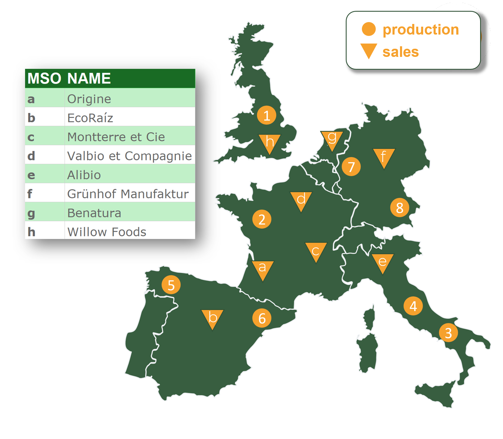
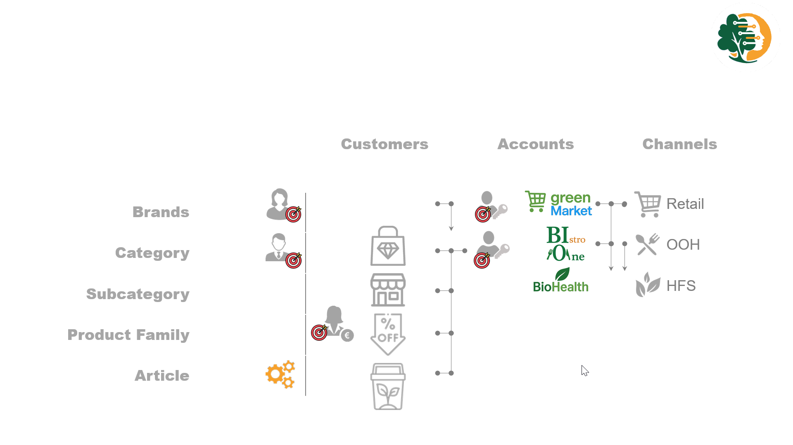
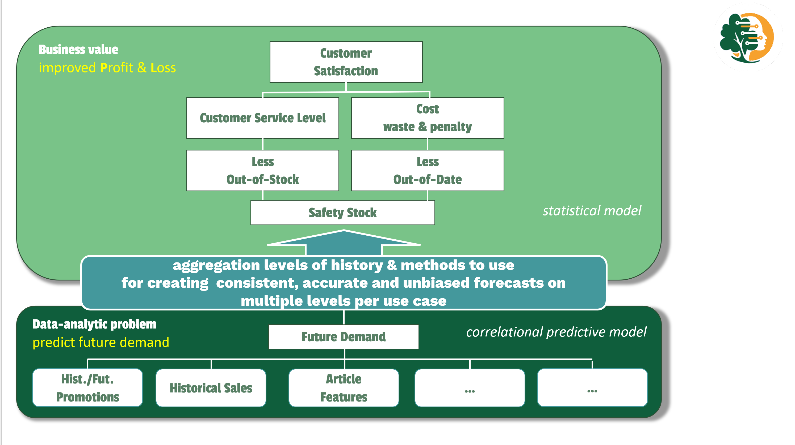

# Business Understanding {#sec-01-business-understanding}

```{r}
#| label: setup
source("../_book_functions.R")
```

## Overview {#sec-11-overview}

This chapter provides a detailed look into the business context and challenges faced by *BioBalance*, a multi-channel FMCG company. We begin by illustrating why forecasting matters, using a real-life example (Blossam tea), followed by an overview of stakeholder-specific forecasting needs across departments.

Next, we define the core business problem — the lack of an objective benchmark to evaluate manual forecast adjustments — and explain how this project aims to address that issue.

We then introduce Pythia’s Advice, a parallel forecasting environment designed to quantify Forecast Value Added (FVA) and support more effective decision-making.

Finally, we outline the current forecasting process and establish criteria to measure the success of this initiative.

## Why is Forecasting Important? {#sec-01-bu-why}

<!-- Contextualize the business problem and its forecasting relevance. -->

Accurate forecasting is essential for managing *BioBalance’s* portfolio of over 2.500 products, each with specific shelf-life requirements, sourcing constraints, and production lead times. Forecasts guide decisions across the entire supply chain — from procurement and production to distribution and inventory management. 

### Geographic Footprint and Production Model {#sec-01-geographical}

*BioBalance* operates multiple production facilities and distribution centers across Europe, serving customers in various countries through both direct and indirect channels. As shown in @fig-01-bu-map, these facilities are geographically distributed, and some products are produced in one country but sold in others.

Due to long production and transportation lead times, combined with short customer order lead times, BioBalance follows a Make-to-Stock (MTS) strategy for most of its portfolio. Products must be manufactured and positioned in the supply chain ahead of actual demand. To support this, the Marketing and Sales Organizations (MSOs) place minimum order quantities (MOQs) in advance to cover expected demand for the upcoming weeks. An illustrative example of these goods flows is shown in Appendix @fig-11-supplychain-goodsflow.

As a result, accurate forecasting is essential to:

-   Plan & schedule production volumes and resources at the  plants
-   Balance inventory to avoid excess inventory or costly stockouts
-   Strategic planning, create budgets and sales targets

This operational model places forecasting at the core of supply chain responsiveness and profitability.

::: {#fig-01-bu-map .figure}
{fig-align="left" width="8cm"}

Geographic footprint of *BioBalance*: production and distribution sites
:::

### *Blossam* Tea: an illustrative example {#sec-01-blossam}

The planning process for *Blossam Balance Tea* illustrates the complexity of forecasting across stages, see @fig-01-bu-why:

:::: {#fig-01-bu-why .figure}
::: {.content-visible when-format="html"}
<div class="responsive-video">
<video src="../video/bu_why.mp4" controls autoplay muted loop width="640" playsinline>
</video>
</div>
:::

::: {.content-visible when-format="pdf"}
{caption="Why is forecasting important? It drives the business." fig-align="left" fig-width="15cm"}
:::

Why forecasting? The forecast drives the business!
::::

**Make**: The tea must be produced at least 3 months in advance, requiring short-term accuracy for production scheduling.

**Source**: Tea leaves are procured via contracts negotiated 12 months ahead, depending on long-term demand planning.

**Deliver**: Different sales channels impose distinct shelf-life expectations — premium retailers require over 180 days, while discounters accept 60 days but with lower margins.

Failure to meet shelf-life constraints can result in:

-   Out-Of-Stocks (OOS): Lost sales, penalties, and de-listing.
-   Out-Of-Date (OOD): Product waste and write-offs.

These challenges are not unique to *Blossam*; they apply across the full product range.

## Stakeholder Use Cases {#sec-01-stakeholder}
<!-- stakeholders. -->

The company's forecasting requirements vary significantly across several key use cases.

:::: {#fig-01-bu-who .figure}
::: {.content-visible when-format="html"}
<video src="../video/bu_who.mp4" controls autoplay muted loop width="640" playsinline>

</video>
:::

::: {.content-visible when-format="pdf"}
<!-- this block only appears in PDF output -->

{fig-align="left" fig-width="15cm"}
:::

who uses the forecasts? varying requirements across several key use cases.
::::

```{r}
#| label: tab-forecasting-use-cases

# Read the data into a data.table 
dtUC <-  fread(text = "
  Department       , Use Case                    , Level             , Horizon
  Central Sourcing , Buying & Production         , Article           ,  12  weeks
  Finance	         , Transfer pricing	           , Article           ,   6  quarters
  Supply Planning  , Safety stock profiling      , Article * WH      ,  52  weeks
  MRP System	     , Replenishment	             , Article * WH      , 104  weeks
  Marketing & Sales, Strategic planning	         , Brand/Category    ,   12 months
  Key Accounts     , Negotiation & target setting, Category * Account, 6–12 months
")

# Create a styled kableExtra table
dtUC |> 
  kbl(
    caption   = "Forecast Use Cases by Department",
    col.names = c("Department", "Use Case", "Forecast Level", "Horizon"),
    align     = c("l", "l", "l", "l"),
    booktabs  = TRUE
  ) |> 
  kable_styling(
    full_width = FALSE,
    position   = "left",
    bootstrap_options = c("striped", "hover", "condensed")
  )
```

A detailed overview is available in (@sec-11-stakeholder).

## Scope of the Project {#sec-01-bu-scope}

This research is limited to articles sold to customers (**Finished Goods**) 
that are **MRP-relevant** and planned under a **Make-to-Stock** strategy. 
Products with short shelf lives, requiring chilled storage and daily planning, 
are excluded due to their distinct planning characteristics.

The study further focuses on the most commercially significant part of *BioBalance’s* operations: the Market Sales Organization (MSO) with the highest sales volume in 2024. This selection is based on the exploratory analysis presented in @fig-02-eda-geography and ensures that the results are directly applicable to the area with the greatest business impact.

Within this scope, we specifically target ambient products with a minimum shelf life of 60 days. These products are planned in weekly MRP cycles and forecasted using monthly time buckets. They represent the majority of *BioBalance’s* volume and align best with the strategic forecasting use cases addressed in this study.


## Problem Statement {#sec-01-problem-statement}

While *BioBalance* uses a flexible forecasting platform, its reliance on manual adjustments and subjective decision-making introduces inconsistency. Forecasting methods and aggregation levels are often chosen based on intuition and experience. Research shows, see [@article], that small manual adjustments typically offer no benefit, whereas larger interventions—usually reductions—may significantly improve accuracy.

Without an objective benchmark, it is impossible to determine whether these manual interventions improve accuracy or merely increase resource costs.

## Business Objectives {#sec-01-business-objectives}

<!-- define business objectives, What is the business's need? -->

This project aims to improve forecast accuracy and planning efficiency by introducing:

-   A transparent, low-cost statistical benchmark.

-   A decision-support tool to guide value-adding interventions.

-   A scalable, consistent method applicable across different aggregation levels.

These objectives align with *BioBalance’s* strategic priorities, which include:

1.  Optimize safety stock levels.

2.  Reduce Out-Of-Stock (OOS) and Out-Of-Date (OOD) inventory.

3.  Improve customer service levels and reduce waste.

4.  Increase customer satisfaction through consistent availability.

And ultimately increase profitability, as illustrated in @fig-01-bu-daps, see [@demast2024].

::: {#fig-01-bu-daps .figure}
{fig-align="left" fig-width="15cm" fig-alt="DAPS"} Data-Analytic Problem Structure (DAPS)
:::

### Pythia’s Advice: A System of Innovation {#sec-01-pythia-advice-system}

To support these goals, we introduce **Pythia’s Advice** — a parallel forecasting environment that runs alongside the production system. Named after the oracle of Delphi, it serves as a low-cost advisory layer that complements the existing forecasting system.

Pythia’s Advice provides:

-   A minimal-resource benchmark:  
    low-cost, automated forecast based on statistical models (e.g., ETS, HTS).

-   An internal reference for calculating Forecast Value Added (FVA).

-   A scalable, low-cost, open-source infrastructure.

This environment was deliberately designed to operate in parallel, with read-only access to the production system. This avoids interference with business-critical forecasting workflows and eliminates the risk of disrupting day-to-day operations.

Additionally, the project was developed under the constraint of limited access to business resources — both in terms of time and geographical availability. Demand planners and analysts needed to prioritize operational continuity, requiring the research to be conducted independently while still aligning with business realities.

By working within these constraints, **Pythia’s Advice** enables experimentation and benchmarking without disrupting operations — providing a safe and scalable way to measure the value of forecast improvements.
**Pythia’s Advice** is represented by the lower part of the Data-Analytic Problem Structure (DAPS), (@fig-01-bu-daps).

## Forecast Process {#sec-01-forecast-process}

<!-- Business process mapping -->

*BioBalance* relies on a third-party system that uses traditional statistical models (see Appendix @tbl-11-stat-methods). Figure @fig-01-bu-proc illustrates the forecasting steps demand planners follow. Although presented sequentially, these steps often require multiple iterations. Table @tbl-01-demand-planners-activities provides a detailed breakdown.

*Pythia’s Advice* seeks to eliminate those iterations, enhancing both efficiency and forecast accuracy.


:::: {#fig-01-bu-proc .figure}
::: {.content-visible when-format="html"}
<video src="../video/bu_proc.mp4" controls autoplay muted loop width="640" playsinline>

</video>
:::

::: {.content-visible when-format="pdf"}
<!-- this block only appears in PDF output -->

{caption="Why is forecasting important? " fig-align="left" fig-width="15cm"}
:::

The forecasting process: requiring human expertise.
::::


::: {#tbl-01-demand-planners-activities}
```{r}

 wb_read(
    file                = ET2BB,
    sheet               = "bu_fp",
    start_row           = 1,
    start_col           = 1,
    skip_empty_cols     = TRUE,
    skip_empty_rows     = TRUE
  )                                  %T>%
  setDT()                            %T>%
  setorder(ID)                        %>%
  .[, !"ID"]                          %>%
  .[, PA:= ifelse(is.na(PA), '', PA)] %>%
  kbl(
    col.names           = c("Demand planner", "Pythia Advises on"), 
    align               = "l",
    booktabs            = TRUE
  ) %>%
  kable_styling(
    full_width          = FALSE,
    position            = "left",
    bootstrap_options   = c("striped", "hover", "condensed")
  )
```

Forecasting steps per forecast, Pythia's Advice to improve efficiency.
:::

::: callout-important
The initial scope of the project is to share the unadjusted forecast and its resulting accuracy with demand planners as a benchmark. This lets them see the impact of their manual adjustments and provides a foundation for continuous improvement.

*Building trust must come first before moving on to subsequent steps.*  \
**TRUST is all you need**

:::


## Success Criteria {#sec-01-success-criteria}

The success of this project will be measured by:

-   A measurable increase in forecast accuracy (RSME and reduced bias)

-   Reduced time and effort spent on non-value-adding manual adjustments

-   Improved inventory KPIs (lower OOS/OOD rates)

-   Consistent forecasts across aggregation levels

-   Positive feedback from planners and stakeholders

## Summary {#sec-01-summary}

In summary, this chapter defined the business context, stakeholders, and objectives that guide the rest of this project. The next phase, Data Understanding, explores the availability, quality, and suitability of the data used to support these forecasting use cases.

<!--  -->
