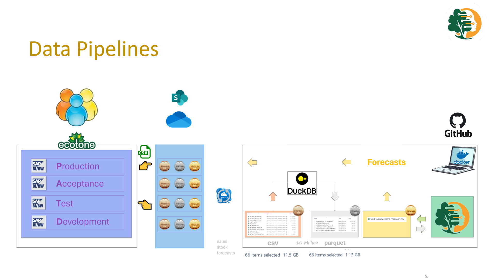

# Data Understanding {#sec-02-data-understanding}

```{r}
#| label: setup
source("../_book_functions.R")
```

## Identification of Data Sources

<!-- Describe what data is available and where it comes from. -->
Table @tbl-02-data-sources summarizes the data sources used in this project, 
detailing their type, time span, granularity, system of record (SoR), and content. 
All data is sourced from SAP BI, which extracts it from the underlying 
systems of record. 
The table also lists the specific SAP tables used for each data source.

::: {#tbl-02-data-sources}
```{r}

# Read the data into a data.table 
dtDS <-  fread(text = "
  Data Source, Type, Time-Span, Granularity, SoR   , Table, Content
  article    , MD  ,          ,            , SAP S4, MARC , article attr.  & hierachy
  customer   , MD  ,          ,            , SAP S4, KNVV , customer attr. hierachy
  sales      , TD  , > 2020   , daily      , SAP S4, LIPS , customer orders + free-of-charge 
  forecasts  , TD  , > 2023   , monhtly    , QAD   ,      , monthly pre- & post Demand review forecasts
")

# Create a styled kableExtra table
dtDS %>% 
  kbl(
    # caption             = "Overview of data sources used in the project",
    col.names           = names(.),
    align               = "l",
    booktabs            = TRUE
  ) %>% 
  kable_styling(
    full_width          = FALSE,
    position            = "left",
    bootstrap_options   = c("striped", "hover", "condensed")
  )  
```
Overview of data sources used in the project  
MD = Master Data, TD = Transaction Data
:::

<!-- PDF -->
<!-- %>% -->
<!--   footnote( -->
<!--     general           = "MD = Master data, TD = Transaction Data", -->
<!--     footnote_as_chunk = TRUE, -->
<!--     threeparttable    = FALSE, -->
<!--     escape            = FALSE -->
<!--   ) -->

<!-- Subsections: -->

### Articles

The Article Master Data is extracted from `MARC` which contains Plant specific 
data, this is enhanced with sales organization specific data from `MVKE` and 
global article data from `MARA`, applied filters are shown in Table @tbl-02-data-sources-article-filters.

::: {#tbl-02-data-sources-article-filters}
```{r}

dtAF <-  fread(text = "
  FIELD      , Filter                        , Reason
  MARA-MTART , HAWA; FERT; VOLL              , only finished goods
  MARA-STRGRP, Z1                            , only Make-to-Stock   
  MARC-DISMM , ZC; ZD; ZG; ZH; ZI; ZJ; ZN; ZP, only MRP relevant
  MARC-PERKZ , W                             , only Ambient
  ")

# Create a styled kableExtra table
dtAF %>% 
  kbl(
    caption             = "Article Master Data Filters",
    col.names           = names(.),
    align               = "l",
    booktabs            = TRUE
  ) %>% 
  kable_styling(
    full_width          = FALSE,
    position            = "left",
    bootstrap_options   = c("striped", "hover", "condensed"),
    latex_options       = c("striped", "hold_position")    
  )
```

Article Master Data Filters  
see @sec-01-bu-scope for reasons for article-filters.
:::

### Customers

Customer Master Data is sourced from `KNVV`, which contains sales-organization-specific information, and is enriched with global attributes from `KNA1`. This includes customer classification fields such as type (e.g., internal, external, one-time customer, or employee). Customers flagged as employees are excluded from the analysis.

### Sales
<!-- Data filters applied (Doctype's, Item category, ...) -->
<!-- exclude Promotion articles --> 

Sales data is extracted from `LIPS`, which contains delivery records. 
Only completed deliveries which are goods-issued are taken into account. 

Table @tbl-02-data-sources-sales-filters shows the applied filters to select
standard sales orders and free-of-charge orders. 

::: callout-important
Articles flagged in the Article Master data as Fixed Planned Promotions are excluded because they aren’t forecasted—instead, they’re delivered by contract and thus always achieve 100 % forecast accuracy.
:::

::: {#tbl-02-data-sources-sales-filters}
```{r}

dtSF <-  fread(text = "
  Document Type, Item Category  , Reason
  TA           , TAN; ZTAQ; YGF1, standard sales orders
  KB; ZDR      ,                , standard sales orders
  TA           , TANN; ZTNG     , free-of-charge orders
  KL; ZFD      ,                , free-of-charge orders
  ")

# Create a styled kableExtra table
dtSF %>% 
  kbl(
    caption             = "Sales Data Filters",
    col.names           = names(.),
    align               = "l",
    booktabs            = TRUE
  ) %>% 
  kable_styling(
    full_width          = FALSE,
    position            = "left",
    bootstrap_options   = c("striped", "hover", "condensed"),
    latex_options       = c("striped", "hold_position")    
  )
```
Sales data filters
:::

### Forecasts

Forecasts are generated monthly for each article–plant–customer combination, with a planning horizon of up to three years. For this research, the focus is on the year 2024, using a forecast horizon of up to 12 months. Consequently, only forecasts generated from 2023 onward are considered.

Since forecasts are created both before and after the Demand Review, the dataset is split into two versions: *pre-Demand Review* and *post-Demand Review*. The pre-Demand Review forecasts are used for the initial analysis, while the post-Demand Review forecasts serve as the basis for final validation.

## Data Collection Report
<!-- Summarize how data was obtained and any issues during acquisition: -->

### Data Collection

Table @tbl-02-data-collection summarizes the data collection process, including the data sources, types, extraction dates, record counts, file sizes, and keys used for each dataset. The data is collected from the SAP system and stored in a structured format for further processing.

Pre- and post-Demand Review forecasts are stored as separate files, one for each month in which they were created. Each file is named to reflect the extraction date.The key is  essential for linking the datasets during analysis.

::: {#tbl-02-data-collection}
```{r}

# Read the data into a data.table 
dtDC <-  fread(text = "
  Data Source, Type, Extract Date, Records, Size    , Files, Key
  article    , MD  , 21-01-2025  ,        , 1.691 KB,     3, Article     
  customer   , MD  , 21-01-2025  ,        , 1.345 KB,     2, Customer
  sales      , TD  , 21-01-2025  ,        , 1.7   GB,     4, Date; Article; Plant; Customer
  forecasts  , TD  , 21-01-2025  ,        , 8.99  GB,    48, Date; Article; Plant; CustHier3
")

# Create a styled kableExtra table
dtDC %>% 
  kbl(
    # caption             = "Data Collection ",
    col.names           = names(.),
    align               = "l",
    booktabs            = TRUE
  ) %>% 
  kable_styling(
    full_width          = FALSE,
    position            = "left",
    bootstrap_options   = c("striped", "hover", "condensed")
  )
```
Data Collection
:::

### Data Collection Process

The data flow is illustrated in Figure @fig-02-dp01, outlining the steps from data extraction to forecast delivery. The process follows a medallion architecture, 
where data flows into *Pythia’s Advice* through the Bronze and Silver layers and 
returns the generated forecasts to SAP via the Gold layer.

1. Data is extracted from the **Production** SAP system using Open Hub technology 
   and stored on OneDrive in the Bronze layer of the staging area, following 
   the medallion structure.

2. OneDrive synchronizes the data, making it accessible to the System of Innovation: 
   *Pythia’s Advice*.

3. An in-process DuckDB session reads the CSV files, applies light transformations 
  (e.g., renaming, formatting), and converts them to Parquet format, reducing file size 
  by up to 90%. The output is stored in the Silver layer.

4. The transformed data is then loaded into *Pythia’s Advice*, where it is prepared 
   for modeling. Forecasts are generated and exported to the Gold layer as plain CSV 
   files.

5. Finally, the generated forecasts are written back to the **Test** SAP system, 
   where they can be compared against the business forecasts in terms of forecast 
   accuracy.

::: {#fig-02-dp01 .figure}
{fig-align="center"}
:::


### Transformations

Light transformations are applied to the exported CSV files, including field renaming, data type conversions, date formatting, and adding leading zeros where needed. Additionally, a new variable is computed to capture the number of months between the forecast creation date and the forecasted period.

Table @tbl-02-data-transformations lists all transformations applied to each 
dataset. Use the `SRC` column to filter transformations: 

- `O` indicates original 1:1 mappings, 
- `C` denotes custom transformations involving additional logic, filtered by default.

<!-- DuckDB tranformations -->
```{r}
#| label: tab-02-data-db-transformations
dtTF <- pa_transformations_get() %>%
  .[, POSIT:= NULL]

```

::: {#tbl-02-data-transformations}
::: {.content-visible when-format="html"}

```{r}
#| label: tab-02-data-transformations-html
#| 
datatable(
  dtTF,
  options = list(
    pageLength = 5,
    lengthMenu = c(5, 10, 25, 50, 100, 2000),
    autoWidth  = TRUE,
    scrollX    = TRUE,
    filter     = "top",  # or "bottom",
    searchCols = list(
      NULL,               # No filter on column OHDEST
      NULL,               # No filter on column DATATYPE
      NULL,               # No filter on column FLDNM_IN
      NULL,               # No filter on column FIELDTP      
      NULL,               # No filter on column TRNSFRM
      NULL,               # No filter on column FLDNM_OUT      
      list(search = "C")  # Filter column SRC on value "C"
      # Add more elements for other columns if needed
    )
  ),
  rownames     = FALSE,
  class        = 'stripe hover compact'
) %>%
  formatStyle(
    columns  = names(dtTF),
    fontSize = '0.8em'          # reduce font size
  )
```

:::
  
::: {.content-visible when-format="pdf"}
  
```{r}
#| label: tab-02-data-transformations


dtTF %>% 
  kbl(
    caption             = "Data Transformations ",
    col.names           = names(.),
    align               = "l",
    booktabs            = TRUE
  ) %>% 
  kable_styling(
    full_width          = FALSE,
    position            = "left",
    bootstrap_options   = c("striped", "hover", "condensed")
  )
```

:::
DuckDB transformations
:::

## Data Description Report

<!-- Descriptive overview of structure and metadata: Open Hub definition -->
<!-- Variable types (date, categorical, numeric) -->
<!-- Dimensions (rows × columns) -->
<!-- Target variable (e.g., sales units, net revenue) -->

```{r}
# DT with Filter in Appendix
 wb_read(
    file      = ET2BB,
    sheet     = "DD",
    start_row = 1,
    start_col = 1,
    skip_empty_cols = TRUE,
    skip_empty_rows = TRUE
  )  %T>%
  setDT() %>%
  .[PYTHIA == 'Y', !"PYTHIA"] %>%
  # .[is.na(KEY), KEY:= ''] %>%
  kbl(
    caption             = "Data Description",
    col.names           = names(.),
    align               = "l",
    booktabs            = TRUE
  ) %>%
  kable_styling(
    full_width          = FALSE,
    position            = "left",
    bootstrap_options   = c("striped", "hover", "condensed")
  )
```

```{r}
# DT with Filter in Appendix
# dataLoads
 wb_read(
    file      = ET2BB,
    sheet     = "DATA_LOADS",
    start_row = 1,
    start_col = 1,
    skip_empty_cols = TRUE,
    skip_empty_rows = TRUE
  )  %T>%
  setDT() %>%
  .[RELEVANT == 'Y', !"RELEVANT"] %>%
  # .[is.na(KEY), KEY:= ''] %>%
  kbl(
    caption             = "Data Loads",
    col.names           = names(.),
    align               = "l",
    booktabs            = TRUE
  ) %>%
  kable_styling(
    full_width          = FALSE,
    position            = "left",
    bootstrap_options   = c("striped", "hover", "condensed")
  )
```

```{r}
#| label: tab-02-data-description

# Read the data into a data.table 
dtDD <-  fread(text = "
  Data Source, Date , Categorical, Numeric
  article    ,      ,         12 ,   0      
  customer   ,      ,         6  ,   0     
  sales      , Day  ,         7  ,   2     
  forecasts  , Month,         7  ,   2     
")

# Create a styled kableExtra table
dtDD %>% 
  kbl(
    caption             = "Data Description ",
    col.names           = names(.),
    align               = "l",
    booktabs            = TRUE
  ) %>% 
  kable_styling(
    full_width          = FALSE,
    position            = "left",
    bootstrap_options   = c("striped", "hover", "condensed")
  )
```

```{r}


ACC <-                              # 
  pa_td_dyn_get(
    .vtype       = c('010', '060')  , # 010 = Actuals, 060 = Forecast
    .ftype       = c(1, 2)          , # 1 = PreDR, 2 = PostDR 
    .material    = NULL      , # Optional user-supplied material
    .salesorg    = 'FR30'    , #'Optional user-supplied salesorg
    .scope_matl  = TRUE      , # restrict to Pythia Scope
    .scope_sorg  = TRUE      , # restrict to Pythia Scope
    .cm_min      = '202101'  , # minimal Cal Month
    .cm_max      = '202412'  , # maximal Cal Month
    .step_min    = 1         , # minimal forecast step ahead
    .step_max    = 18        , # maximal forecast step ahead
    .lagg_min    = -1        , # minimal diff. between VERSMON & MONTH
    .lagg_max    = -1        , # maximal diff. between VERSMON & MONTH  
    .n           = Inf  
  ) 


  wb_read(
    file      = ET2BB,
    sheet     = "ACC",
    start_row = 1,
    start_col = 1,
    skip_empty_cols = TRUE,
    skip_empty_rows = TRUE
  )  %>%
  setDT() %>%
  .[is.na(KEY), KEY:= ''] %>%
  kbl(
    caption             = "Sales & Forecast metadata",
    col.names           = names(.),
    align               = "l",
    booktabs            = TRUE
  ) %>% 
  kable_styling(
    full_width          = FALSE,
    position            = "left",
    bootstrap_options   = c("striped", "hover", "condensed")
  )


  wb_read(
    file      = ET2BB,
    sheet     = "ACC_TA",
    start_row = 1,
    start_col = 1,
    skip_empty_cols = TRUE,
    skip_empty_rows = TRUE
  )  %>% 
  kbl(
    caption             = "Sales & Forecast Fields, Unique Count and Example",
    col.names           = names(.),
    align               = "l",
    booktabs            = TRUE
  ) %>% 
  kable_styling(
    full_width          = FALSE,
    position            = "left",
    bootstrap_options   = c("striped", "hover", "condensed")
  )
```

## Data Exploration Report

<!-- Exploratory analyses & sanity checks   -->
<!-- statistical properties and metadata. -->
<!-- Initial exploration to spot trends, seasonality, outliers, and segmentation patterns. -->
<!-- Subsections (as needed): -->
<!-- Sales coverage: distribution over time -->
<!-- ABC/XYZ, CV, zero-counts, sales length -->
<!-- Temporal patterns (weekly/monthly seasonality, trend, events) -->
<!-- Cross-sectional: contribution per customer/product/channel -->
<!-- exclude units pak and DS   -->

::: {#fig-02-eda-geography .figure}

### Geographic Distribution of Sales

```{r}
#| fig-height: 4
#| fig-width: 6
#| 
dtMSO <- 
  wb_read(
    file      = ET2BB,
    sheet     = "SORG",
    start_row = 1,
    start_col = 1,
    skip_empty_cols = TRUE,
    skip_empty_rows = TRUE
  )                                   %T>%
  setDT()                              %>%
  setnames(
    c("SHARE"  , "BB-TEXT"),
    c("Percent", "MSO")
    )                                    %>%
  setorder(-Percent)                     %>%
  .[, Percent := Percent* 1]           %>%
  .[, ymax    := cumsum(Percent)]        %>%
  .[, ymin    := shift(ymax, fill = 0)]

# Sort factor levels so bars appear from smallest to largest (bottom to top)
dtMSO$MSO <- factor(dtMSO$MSO, levels = dtMSO$MSO[order(dtMSO$Percent)])

# Define a green color gradient: dark to light green
green_palette <- colorRampPalette(c("#38e56d", "#0f5e3c"))(7)  # darkgreen to lightgreen

# ggplot(dtMSO) +
#   geom_rect(aes(
#     xmin = 0.3, xmax = 0.7,
#     ymin = ymin, ymax = ymax,
#     fill = MSO
#   )) +
#   # coord_flip() +
#   scale_y_continuous(labels = scales::percent_format(scale = 1)) +
#   scale_fill_manual(values = green_palette) +
#   labs(
#     title = "Sales 2024 (in Value)",
#     # y     = NULL, # "Percentage",
#     x     = NULL,
#     fill  = "MSO"
#   ) +
#   theme_minimal() +
#   theme(
#     axis.text.x  = element_blank(), 
#     axis.text.y  = element_text(angle = 0),
#     axis.ticks.x = element_blank()
#   )

ggplot(dtMSO, aes(x = Percent, y = reorder(MSO, Percent))) +
  geom_col(fill = "forestgreen") +
  geom_text(aes(label = percent(Percent)), hjust = -0.1, size = 3.5) +
  scale_x_continuous(labels = percent_format(), limits = c(0, 0.6)) +
  labs(
    title = "Sales Share by Market Sales Organization (MSO)",
    x = "Share of Total Sales",
    y = NULL
  ) +
  theme_minimal(base_size = 12) +
  theme(
    plot.title = element_text(hjust = 0, face = "bold"),
    plot.title.position = "plot",
    panel.grid.major.y = element_blank(),
    axis.text.y = element_text(face = "bold")
  )
```

Scoping the analysis to `r dtMSO[1, MSO]`, which accounts for 
`r paste(round( 100 * dtMSO[1, Percent], 2), '%')` of total sales in 2024.
:::

### Data Profiling

```{r}
#| label: skim-summary
#| results: 'asis'

dtACC_sk <- ACC %>%
  skim(.) %T>%
  setDT() %T>%
  setnames(c(
    "type",
    "variable", "n_missing", "complete_rate", 
    "min_length", "max_length", "empty", "n_unique", "whitespace", 
    "mean", "sd", "p0", "p25", "p50", "p75", "p100", "histogram"
  ))
```

#### Character Variables

Table @tbl-02-data-profiling-ca shows the data profiling results for the dataset,
including the number of missing values, completeness rate, minimum and maximum length 
for character variables. The profiling helps identify data quality issues and 
provides insights into the structure of the dataset.

::: {#tbl-02-data-profiling-ca}
```{r}
dtACC_sk[
  type == 'character', .(
    variable, 
    n_missing, complete_rate,
    min_length, max_length, empty, n_unique, whitespace
  )] %>% 
  kbl(
    # caption             = "Data Profiling: Character Variables",
    col.names           = names(.),
    align               = "l",
    booktabs            = TRUE
  ) %>% 
  kable_styling(
    full_width          = FALSE,
    position            = "left",
    bootstrap_options   = c("striped", "hover", "condensed")
  )
```
Data Profiling: Character Variables
:::

::: callout-note
This data set is of high quality and doesn't need any further analysis on 
the character variables.
:::


#### Numeric Variables

Table @tbl-02-data-profiling-nu shows the data profiling results for the 
numeric variables in the dataset, including mean, standard deviation, and 
percentiles. The histogram column provides a visual representation of 
the distribution of each numeric variable.

::: {#tbl-02-data-profiling-nu}
```{r}
dtACC_sk[
  type == 'numeric', .(
    variable, 
    mean, sd, p0, p25, p50, p75, p100, histogram
  )]  %>% 
  kbl(
    # caption             = "EDA: Numeric Variables",
    col.names           = names(.),
    align               = "l",
    booktabs            = TRUE
  ) %>% 
  kable_styling(
    full_width          = FALSE,
    position            = "left",
    bootstrap_options   = c("striped", "hover", "condensed")
  )
```
Data Profiling: Numeric Variables
:::

::: callout-important
We see that the Quantity (Q) needs some further analysis due to outliers.
:::


```{r}

dt <- ACC[MATERIAL != '000000000003020642' & VTYPE == '010']

ggplot(dt, aes(x = Q)) +
  # Histogram with density scaling, green fill and border
  geom_histogram(
    aes(y     = ..density..),
    binwidth  = diff(range(dt$Q)) / 100,  # adjust bin width (30 bins here)
    fill      = "lightgreen",
    color     = "forestgreen"
  ) +
  # Density curve on top
  geom_density(
    color     = "forestgreen",
    linewidth = 1
  ) +
  labs(
    title     = "Histogram of Q with Density Overlay",
    x         = "Q",
    y         = "Density"
  ) +
  theme_minimal()
```


<!-- } else { -->
<!--   dtMATL_sk %>% -->
<!--     kable("latex", booktabs = TRUE, caption = "Variable Description Report") %>% -->
<!--     kable_styling(latex_options = c("striped", "hold_position"), full_width = FALSE) -->
<!-- } -->

### Article Hierachy

```{r}
#| label: tab-02-data-description-hierarchy

# Read the data into a data.table
dtMAT <- wb_read(
  file      = file.path(OD, "ET2BB.xlsx"),
  sheet     = "MASP",
  start_row = 19,
  start_col = 6,
  skip_empty_cols = TRUE,
  skip_empty_rows = TRUE
) %T>%
  setDT() %T>%
  setnames(
    c(4, 6, 8, 9), 
    c("ProdCat", "SubCat", "Family", "Article")
  ) %>%
  .[, .(ProdCat, SubCat, Family, Article)] %>%
  unique()

dtMAT_tab <- dtMAT[, .(
  SubCat_Count   = uniqueN(SubCat),
  Family_Count   = uniqueN(Family),
  Article_Count = uniqueN(Article)
), by = ProdCat][order(ProdCat)]

dtCUST <- wb_read(
  file      = file.path(OD, "ET2BB.xlsx"),
  sheet     = "CUST",
  start_row = 19,
  start_col = 9,
  skip_empty_cols = TRUE,
  skip_empty_rows = TRUE
) %T>%
  setDT() %T>%
  setnames(c(1), c("KEY")  ) 

dtCUST_H1 <- wb_read(
  file      = file.path(OD, "ET2BB.xlsx"),
  sheet     = "CUST_H1",
  start_row = 1,
  start_col = 1,
  skip_empty_cols = TRUE,
  skip_empty_rows = TRUE
) %T>%
  setDT() %T>%
  setnames(c(1), c("KEY")  )

dtCST <- 
  dtCUST_H1[dtCUST, on = .(KEY), nomatch = 0] %T>%
  setnames(
    c(4, 7, 9, 11),
    c("Channel", "Key_Account", "Account", "SoldTo")
  ) %>%
  .[, .(Channel, Key_Account, Account, SoldTo, Customer)] %>%
  unique()

dtCST_tab <- dtCST[, .(
  KAM_count      = uniqueN(Key_Account),
  ACC_Count      = uniqueN(Account),
  SoldTo_Count   = uniqueN(SoldTo),
  Customer_Count = uniqueN(Customer)
), by = Channel][order(Channel)]
```

Table @tbl-02-data-description-hierarchy-article summarizes the 4-levels of the article hierarchy by a unique count per level. Roughly,

- each Family contains roughly `r mean(dtMAT_tab$Article_Count/dtMAT_tab$Family_Count) %>% round(0)` articles.
- each Sub Category contains roughly `r mean(dtMAT_tab$Family_Count/dtMAT_tab$SubCat_Count) %>% round(0)` families.

::: {#tbl-02-data-description-hierarchy-article}  
```{r}

datatable(
  dtMAT_tab,
    options      = list(
    dom          = 't',          # only the table ("t"); no filter, no pagination controls
    paging       = FALSE,        # disable pagination
    searching    = FALSE,        # disable search bar
    info         = FALSE,        # hide “Showing X of Y” info
    ordering     = TRUE,         # keep column sorting enabled (default = TRUE)
    lengthChange = FALSE,        # hide “Show N entries” dropdown
    columnDefs   = list(
      list(className = 'dt-left', targets = 0)
    )  
    )
,
  rownames     = FALSE,
  class        = 'stripe hover compact'
) 


```

Summary: Article Hierachy
:::

::: {.content-visible when-format="html"}

### Article Hierachy

The following interactive chart allows to explore the hierarchy by 
clicking on the nodes to expand or collapse them. 
:::

::: {#fig-inter_active_article_hier .figure width="15cm"}

::: {.content-visible when-format="html"}

```{r}
#| label: tab-02-data-description-hierarchy-plot

collapsibleTree(
  dtMAT,
  hierarchy   = c("ProdCat", "SubCat", "Family"),
  root        = "Articles",
  width       = "100%",    # now this 100% truly means “fill the parent”
  height      = "600px",   # you can adjust the height as needed
  zoomable    = TRUE,
  fillByLevel = TRUE,
  fill        = "#38e56d"
)
```
Interactive Article Hierarchy, click on the nodes to expand or collapse them.
:::

:::


### Customer Hierarchy

Table @tbl-02-data-description-hierarchy-customer summarizes the 4-levels of the 
customer hierarchy by a unique count per level. Roughly:

- each Family contains roughly 
`r mean(dtCST_tab$Customer_Count/dtCST_tab$SoldTo_Count, na.rm =TRUE) %>% round(0)` customers
- each Account contains roughly
`r mean(dtCST_tab$SoldTo_Count/dtCST_tab$ACC_Count, na.rm =TRUE) %>% round(0)` sold-to parties
- each Key Account contains roughly 
`r mean(dtCST_tab$ACC_Count/dtCST_tab$KAM_count, na.rm =TRUE) %>% round(0)` accounts,

::: {#tbl-02-data-description-hierarchy-customer}
```{r}

datatable(
  dtCST_tab,
  options = list(
    dom          = 't',          # only the table ("t"); no filter, no pagination controls
    paging       = FALSE,        # disable pagination
    searching    = FALSE,        # disable search bar
    info         = FALSE,        # hide “Showing X of Y” info
    ordering     = TRUE,         # keep column sorting enabled (default = TRUE)
    lengthChange = FALSE,       # hide “Show N entries” dropdown
    columnDefs   = list(
      list(className = 'dt-left', targets = 0)
    )
  ),
  rownames     = FALSE,
  class        = 'stripe hover compact'
) 

# dtCST_tab %>%
#   kbl(
#     caption             = "Summary: Customer Hierachy",
#     col.names           = names(.),
#     align               = "l",
#     booktabs            = TRUE
#   ) %>% 
#   kable_styling(
#     full_width          = FALSE,
#     position            = "left",
#     bootstrap_options   = c("striped", "hover", "condensed")
#   )

```

Summary: Customer Hierachy
:::

### Time Series Patterns
let’s explore the time series patterns per category

the hot drinks category exhibits strong seasonality, as tea consumption increases during winter. 

Seasonality or trend plot
Using Time series features, categories can be automatically classified 
 
in the upper left corner, Clipper hot again, demonstrating the expected seasonality-strength.


### ABC - Analysis on Article

Let's define the scope of the project by identifying the high-impact products.

In 2024, we recorded sales of over 2,500 unique products. 
I narrowed my focus to the Market Sales Organization, which accounts for 50% of our global revenue, 
reducing the number to approximately 900 products.


## Data Quality Report

<!-- Assess data integrity and readiness for modeling. -->
<!-- Subsections: -->
<!-- Missing values (which variables, how much, patterns) -->
<!-- Consistency checks (e.g., units vs revenue) -->
<!-- Duplicated records -->
<!-- Outliers: any anomalous spikes or drops? -->

## Data Quality Assessment

<!-- Data Quality Assessment and Remediation -->
<!-- Summarize actions taken: -->
<!-- Imputation strategies -->
<!-- Exclusions (e.g., rare SKUs or obsolete accounts) -->

all 0 

## Key Findings and Readiness Summary

<!-- Short bullets or table summarizing readiness per dataset -->

<!-- What transformations/prep are needed before modeling -->

<!-- Any data limitations that impact scope -->

<!--  -->
