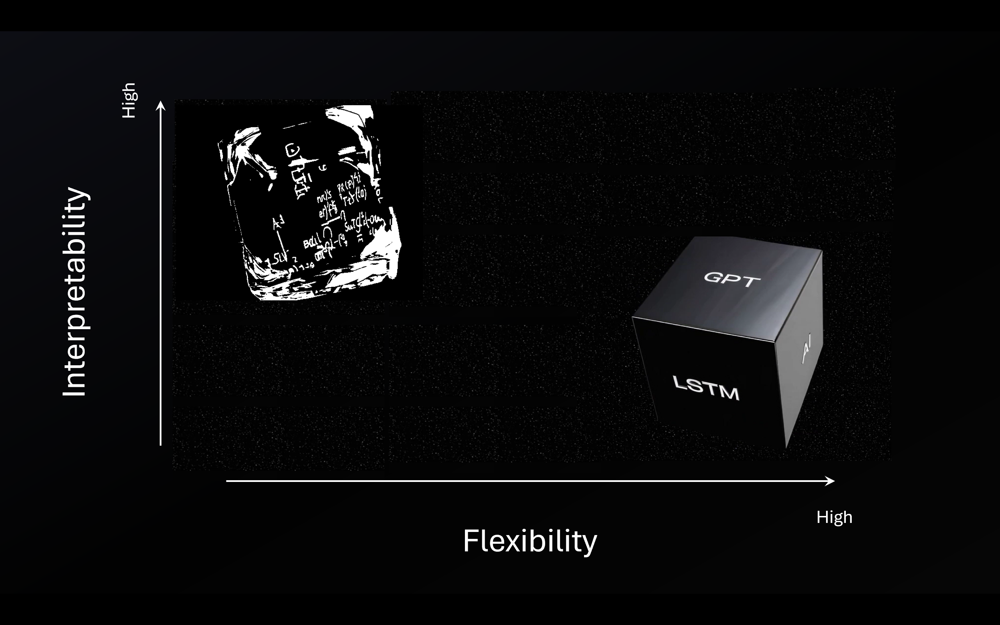
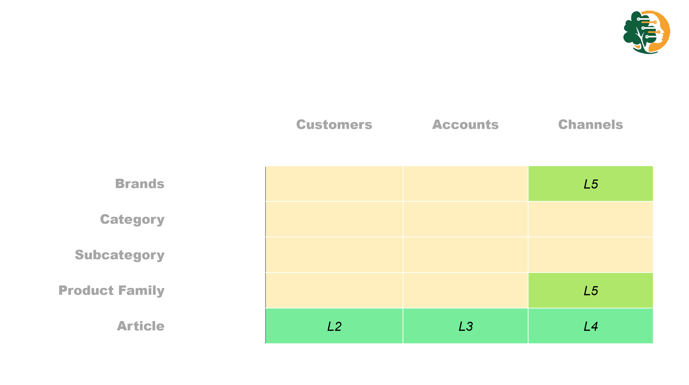
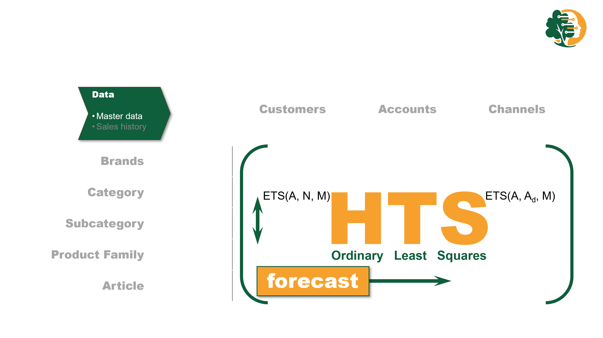

# Modelling {#sec-04-modelling}

```{r}
#| label: setup
source("../_book_functions.R")
```

<!-- - Modelling – Forecasting models and techniques used. -->

<!-- – Algorithms tried (with brief rationale)   -->

<!-- – Hyperparameter approaches   -->

<!-- – Training/validation split -->

## Overview {#sec-04-overview}

<!-- Briefly describe the modelling phase, its objectives, and how it fits into the broader CRISP-DM process. -->

------------------------------------------------------------------------

## Selection of Modelling Techniques {#sec-04-techniques}

<!-- Outline the statistical and machine learning techniques considered (e.g., ETS, ARIMA, Prophet, Hierarchical Time Series). -->

<!--# Univariate -->

In today’s data-rich environment, forecasters have access to a wide array of modelling approaches, ranging from traditional statistical techniques to advanced machine learning and deep learning methods.

**Statistical models** remain the foundation of time series forecasting. They are interpretable, grounded in well-established theory, and help explain how inputs influence outputs. However, they often struggle with capturing non-linear patterns and are limited in handling exogenous factors such as promotions or external events.

**Machine learning models** excel at detecting complex and non-linear relationships in large and diverse datasets. While they often outperform traditional models in terms of predictive accuracy, they come with trade-offs — particularly reduced interpretability and a greater need for careful feature engineering, especially in time-dependent data.

**Deep learning models**, including RNNs, LSTMs, and Transformers, are designed to capture long-term dependencies in time series. They enable automated feature extraction and can model intricate temporal dynamics. However, they are computationally demanding, require substantial data volumes, and offer limited transparency into how forecasts are generated.

::: {#tbl-04-model_summary .table}
```{r}
fread(text = "
  Model Type        , Strengths                                                                , Weaknesses
  Statistical Models, High interpretability; Well-understood theoretical foundation            , Limited ability to model non-linearity; Weak handling of exogenous variables
  Machine Learning  , Handles complex and non-linear patterns; Good with large diverse datasets, Lower interpretability; Requires manual feature engineering
  Deep Learning     , Captures long-term dependencies; Automates feature learning              , Computationally intensive; Requires large datasets; Low transparency
") %>%
  kbl(
    col.names           = names(.),
    align               = "l",
    booktabs            = TRUE
  ) %>% 
  kable_styling(
    full_width          = FALSE,
    position            = "left",
    bootstrap_options   = c("striped", "hover", "condensed")
  )

```

strengths and weaknesses of different modelling approaches
:::

## Model Interpretability and Explainability {#sec-04-tradeoff}

Model selection involves a tradeoff between flexibility and interpretability. **Black-box models** like deep learning offer high flexibility and capture complex patterns, but are opaque.

**Glass-box models**, such as statistical methods, are transparent, showing what is happening inside, and easier to interpret, though less suited to modeling complex effects. *In general, as model flexibility increases, interpretability decreases.*

:::::: {#fig-04-black_glassbox}
:::: {.content-visible when-format="html"}
::: responsive-video
<video src="../video/glass_blackbox.mp4" controls autoplay muted loop style="width: 100%; height: auto;" playsinline>

</video>
:::
::::

::: {.content-visible when-format="pdf"}
{fig-align="left" fig-width="15cm"}
:::

Adapted from: \[[@jamesIntroductionStatisticalLearning2023], figure 2.7\].
::::::

::: {#tbl-04-black_glassbox .table}
```{r}
#| label: fig-04-black_glassbox

  fread(text="
        Method            , Type            , Flexibility, Interpretability
        ETS               , Statistical     , 1          , 5
        ARIMA             , Statistical     , 2          , 5
        Regression        , Statistical     , 2          , 4
        Random Forest     , Machine Learning, 3          , 4
        XGBoost/CatBoost  , Machine Learning, 4          , 2
        LSTM              , Deep Learning   , 5          , 1
        GPT/LLM           , Deep Learning   , 5          , 1
        ") %>%
  kbl(
    col.names           = names(.),
    align               = "l",
    booktabs            = TRUE
  ) %>% 
  kable_styling(
    full_width          = FALSE,
    position            = "left",
    bootstrap_options   = c("striped", "hover", "condensed")
  )

```

Flexibility and interpretability of different statistical learning methods.
:::

### Literature Review

Similar Models - comprehensive overview of the state of the art in machine learning, including the latest algorithms, - insight into the performance of different algorithms and techniques on similar types of data. (avoid wasting time on models that are unlikely to perform well.)

see Literature review (@sec-literature_review)

> To build trust and ensure transparency, *Pythia’s Advice* adopts statistical models, prioritizing interpretability over maximum accuracy. While this limits the ability to capture effects like promotions, it supports confident decision-making. Once trust is established, more advanced machine learning techniques may be considered to enhance performance.

------------------------------------------------------------------------

## Data Preparation for Modelling {#sec-04-data-prep}

<!-- Describe how the data was structured for modelling, including train/test split,  and hierarchical structure. -->

------------------------------------------------------------------------

## Modelling Assumptions {#sec-04-assumptions}

<!-- List any modelling assumptions (e.g., forecast granularity, univariate/multivariate inputs, independence between nodes). -->

------------------------------------------------------------------------

## Model Training and Calibration {#sec-04-training}

<!-- Explain the training approach: cross-validation strategy. -->

------------------------------------------------------------------------

## Forecast Generation {#sec-04-generation}

<!-- Describe how forecasts are generated for each technique, including aggregation levels and forecast horizons. -->

### Model Selection

model performance - only article hierarchy - article and customer hierarchy

-   validity -\>    Forecast Accuracy & Prediction intervals
-   robustness -\>  
-   transparency -\>

### Bottom-Up/Top-down versus Hierachical

Creating coherent forecasts across various levels from a single forecast creates challenges, for example:

The Bottom-up approach, forecasts at detailed levels to be aggregated, however data may be too noisy to identify clear patterns.

The top-down approach, forecasts at aggregated levels, to be distributed however, Seasonal patterns may neutralize each other and disappear, resulting in poor accuracy.

:::::: {#fig-04-mo-method .figure}
:::: {.content-visible when-format="html"}
::: responsive-video
<video src="../video/mo_method.mp4" controls autoplay muted loop width="640" playsinline>

</video>
:::
::::

::: {.content-visible when-format="pdf"}
{fig-align="left" fig-width="15cm"}
:::

Select one of five predefined aggregation levels (L1-L5), HTS forecasts every level for each forecast.
::::::

::: {#fig-04-mo-method2 .figure}
{fig-align="left" fig-width="15cm"} Forecasts are aligned with Ordinary Least Squares (OLS),\
the most detailed is the final output and is coherent with the aggregated forecasts.
:::

------------------------------------------------------------------------

## Model Validation and Performance Metrics {#sec-04-validation}

<!-- Present the evaluation methodology, error metrics (e.g., RMSE, MAPE, bias), and visualizations. -->

Cross-validation is a method for evaluating the performance of a model on a validation dataset. This involves dividing the data into k folds, training the model on k-1 folds, and evaluating the performance on the remaining fold. This process is repeated k times, with each fold serving as the validation set once, and the results are averaged to obtain a final performance score. This method provides a more reliable estimate of the model's performance, as it uses all of the data for training and evaluation.

<!-- --- -->

<!-- ## Model Interpretability and Explainability {#sec-04-explainability} -->

<!-- (Optional) Include techniques for interpreting the forecasts (e.g., SHAP values, residual analysis). -->

------------------------------------------------------------------------

## Tools and Frameworks Used {#sec-04-tools}

This project is implemented in R using an open-source, local-first setup. Modeling and analysis are developed in RStudio and documented using Quarto.

Key components: 

- **Repositories** (hosted on GitHub): 
  - [EAISI-PAPER](https://github.com/Fpadt/eaisi): Project documentation and analysis
  
  - [EAISI-PYTHIA](https://github.com/Fpadt/EAISI-Pythia): Core modeling workflows 
  
  - [EAISI-PADT](https://github.com/Fpadt/EAISI-Padt): **P**ythia's **A**dvice - **D**ata **T**ooling,  
    see Appendix @sec-package-padt, for details and documentation.

-   **R & Quarto Tooling**:
    A full list of packages and technical configuration is provided in the Appendix (@sec-14-tools).

<!-- ## Summary and Lessons Learned {#sec-04-summary} -->

<!-- Summarize findings from the modelling phase and any key takeaways to inform the evaluation phase. -->

<!-- #### Modeling Technique -->

<!-- #### Modeling Assumptions -->

<!-- ### Generate Test Design -->

<!-- #### Test Design -->

<!-- #### Build Model -->

<!-- ### Parameter Settings -->

<!-- #### Models -->

<!-- #### Model Description -->

<!-- ### Assess Model -->

<!-- #### Model Assessment -->

<!-- #### Revised Parameter Settings -->


<!--  -->
