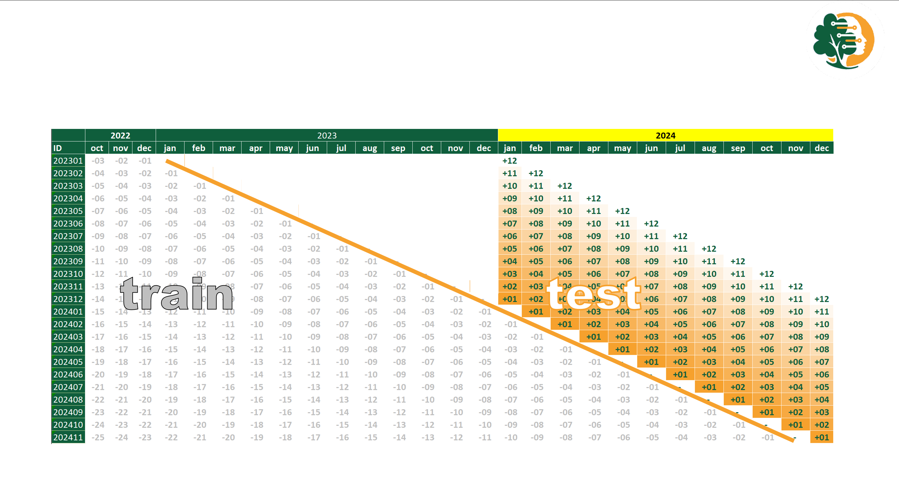

# Evaluation {#sec-05-evaluation}

```{r}
#| label: setup
source("../_book_functions.R")
```

<!--  Evaluation – Analysis of model performance and key findings. -->
<!-- – Performance metrics & visualizations   -->
<!-- – Error analysis   -->
<!-- – Comparison against baseline -->

## Evaluate Results

### Time series Cross-Validation

::::: {#fig-05-cv .figure}
::: {.content-visible when-format="html"}
<video src="../video/ev_cv.mp4" controls autoplay muted loop width="640" playsinline>
</video>
:::

::: {.content-visible when-format="pdf"}
{caption="time series Cross-Validation" fig-align="left" fig-width="15cm"}
:::

Time series Cross-Validation (CV), 12 forecasts for each horizon between 1-12 Months.
:::::

To accurately assess our forecasting capabilities, 
we use a rolling window approach with a 12-month forecast horizon. 

This method enables us to measure forecast accuracy month-by-month, 
providing detailed insights into our predictive precision at various future intervals.

Note that we measure both the short-term, 3-month forecast required for production, 
and the long-term, 12-month forecast needed for sourcing and setting targets.

### Assessment of Data Mining Results w.r.t. Business Success Criteria

-   how well does the model work on new data?

-   For whom does the model not work well?

We derive the Root Mean Squared Error from 12 measurements per horizon
forecast errors of our existing forecasting system.

::::: {#fig-01-bu-why .figure}
::: {.content-visible when-format="html"}
<video src="../video/ev_compare.mp4" controls autoplay muted loop width="640" playsinline>
</video>
:::

::: {.content-visible when-format="pdf"}
{fig-align="left" fig-width="15cm"}
:::

Comparing the forecast errors of our existing forecasting system with the results of our digital twin, we observe that the RMSE (Root Mean Squared Error) remains consistent across both systems.
:::::

When we consolidate all data and calculate forecast accuracy as in the original system, 
we find a Forecast Value Add of 3%.. 


### Approved Models

### Review Process

### Review of Process

### Determine Next Steps

### List of Possible Actions

### Decision

# Appendix {.unnumbered}

<!--  -->
