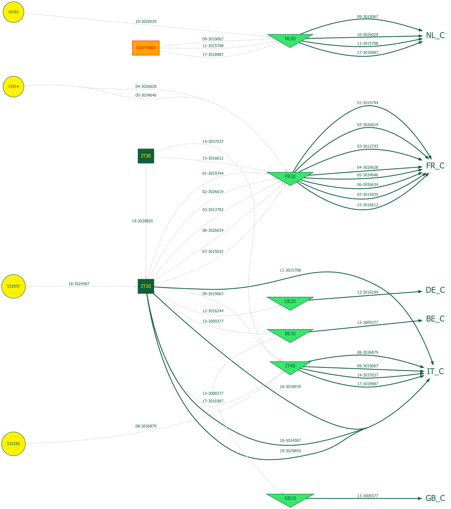
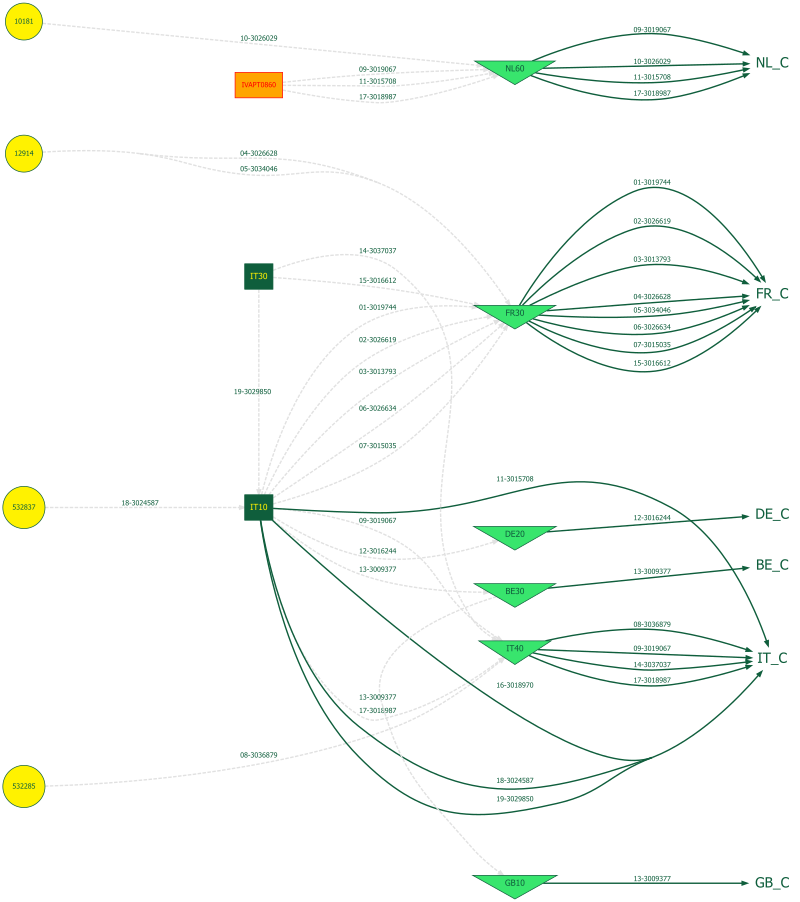

# Business Understanding {#sec-11-business-understanding}

```{r}
#| label: setup
source("../_book_functions.R")
```

## Why is Forecasting Important? {#sec-01-bu-why}

### Geographic Footprint and Production Model

#### Goods Flow

```{r convert‐diagram, include=FALSE}
# make sure you have installed: install.packages("rsvg")
rsvg::rsvg_png(
  svg  = "../images/scn.svg",
  file   = "../images/scn.png",
  width  = 800     # adjust width / height or res as needed
)
```

::: {#fig-11-supplychain-goodsflow .figure}

{fig-alt="Supply Chain Network" fig-align="center" fig-width="15cm"}
:::

<!-- ::: { .content-visible when-format="html"} -->
<!-- ::: {.content-visible when-format="pdf"} -->
<!--     {fig-alt="Supply Chain Network" fig-align="center" fig-width="5cm"} -->
<!-- ::: -->

<!-- Supply-chain goods flows, illustrative example -->

<!-- :::: -->


::: callout-important
Some goods-flow use a Sales/order purchase order flow for intercompany sales. 
These flows need to be forecasted by teh supplier but are also forecasted by the 
receiving MSO. This leads to a double counting of the sales, which needs to be adjusted for.
:::

## Stakeholder Use Cases {#sec-11-bu-who}
<!-- stakeholders. -->

The company's forecasting requirements vary significantly across several key use cases::

1.  **Buying and Production**: The Central Sourcing team requires forecasts 
    at **article level**, aggregated weekly, with a forecast
    horizon of **12 weeks** to share with production and external suppliers.

2.  **Transfer pricing**: Finance requires forecasts at a 
    at **article level**, aggregated quarterly, with a forecast
    horizon of **6 quarters**, grouped into annual time buckets in order to
    calculate the transfer price of articles produced.
    
3.  **Safety stock profiling**: The Supply-Planners require forecasts 
    at the **article * warehouse**, aggregated weekly, with a
    forecast horizon of **26-52 weeks**, to determine safety stock
    profiles based on realized forecast accuracy, lead times and delivery
    performance (On-Time-In-Full).

4.  **Replenishment**: The Material Requirement Planning (MRP) system 
    requires forecasts at a **article * warehouse**, aggregated weekly, with a
    forecast horizon of **104 weeks**, to generate purchase orders and
    production orders.

5.  **Strategic planning	**: Category and Brand managers require 
    forecasts at a **monthly level**, aggregated by **Brand or category**, with a 
    horizon of **12 months** to plan marketing and sales strategies.

6.  **Negotiation with Customers**: Key Account Managers require forecasts at a 
    **monthly level**, aggregated by **categories * key account**, with a 
    horizon of **6 months**.

7.  **Sales Target Setting**: Sales directors require forecasts at a
    **monthly level**, aggregated by **Brand/Categories * key account**, with a 
    horizon of **12 months** to set sales targets for the next year.

1.  **Buying and Production**: Requires forecasts at the **material level** and **warehouse**, aggregated weekly, with a forecast horizon of **12 weeks**.

2.  **Setting Safety Stock Profiles**: Requires forecasts at the **material level** and **warehouse**, aggregated weekly, with a forecast horizon of **26-52 weeks**, to determine safety stock profiles based on realized forecast accuracy.

3.  **Negotiation with Customers**: Requires forecasts at a **monthly level**, aggregated by **material categories** and **customer groups**, with a horizon of **6 months**.

4.  **Production Cost Calculation**: Requires forecasts at a **quarterly level**, aggregated by material, with a horizon of **6 quarters**, grouped into annual time buckets.

    
## Scope of the Project {#sec-01-bu-scope}
## Problem Statement

The primary forecasting challenge is determining the optimal aggregation level and methods to use for generating forecasts that can meet the desired forecast accuracy of these different use cases while ensuring **consistency** and **accuracy**.

This inconsistency stems from a lack of objective criteria for selecting between forecasting methods—**bottom-up**, **top-down**, or **middle-out**—resulting in decisions that rely on the subjective judgment of demand planners, leading to variable performance and inefficiencies.

## Business Objectives

The primary objective is to enhance operational efficiency by improving forecast accuracy across all key use cases. This will be achieved through the application of robust forecasting methods that can handle seasonality, promotions, and efficiently allocate scarce resources. Ultimately, these improvements will contribute to improved stock levels and a higher level of customer satisfaction, both key strategic goals for the company.

1.  **Improved Forecast Accuracy Target**:
    -   **Tailored Forecasts for Each Use Case**: Enhanced accuracy
        across areas such as buying, production, safety stock settings,
        and customer negotiations, using methods that account for
        seasonality, promotions, and varying aggregation levels.
    -   **Reduced Forecast Errors and Bias**: Measurable reductions in
        key error metrics like RMSE , MAPE , and BIAS will lead to
        better alignment between forecasted and actual sales. Increased
        accuracy will also foster trust among supply planners, reducing
        the need for excessive safety margins.
2.  **Selecting the Right Forecasting Methods**: This research will
        guide the selection of optimal exponential smoothing methods (simple,
        double or triple) to improve performance across various use cases.
3.  **Consistency Across Aggregation Levels**: Forecasts will remain
        consistent across different levels of aggregation, ensuring that
        detailed and aggregated forecasts are aligned.


### Pythia’s Advice: A System of Innovation
## Forecast Process
### Traditional statistical forecasting methods 

::: {#tbl-11-stat-methods}

```{r}
#| label: tab-forecasting-methods

# 1) Create a data.table to hold the table data
dt_methods <- data.table(
  Method = c(
    "Moving Average",
    "Simple Exponential Smoothing",
    "Double Exponential Smoothing",
    "Triple Exponential Smoothing",
    "Box-Jenkins (ARIMA/ARMA)"
  ),
  Challenge = c(
    "Seasonality, promotional effects",
    "Seasonality, promotional effects",
    "Seasonality, promotional effects",
    "promotional effects",
    "Stationary data"
  )
)

# 2) Wrap the Method column in cell_spec(bold = TRUE)
dt_methods[, Method := cell_spec(Method, bold = TRUE)]

# 3) Render with kableExtra, disabling escaping so the <b> and \textbf{} get through
dt_methods %>%
  kbl(
    booktabs = TRUE,
    escape = FALSE,
    format = if (knitr::is_latex_output()) "latex" else "html"
  ) %>%
  kable_styling(
    bootstrap_options = c("striped", "condensed"),
    latex_options     = c("striped", "hold_position"),
    full_width        = FALSE
  )
```
Traditional statistical forecasting methods
:::

-   **Proposed Methods**:

    -   **ETS (Error, Trend, Seasonal)**: To enhance exponential
        smoothing with an automated model which selects the appropriate
        exponential smoothing model with the right parameters and provides
        **prediction intervals**.

    -   **HTS (Hierarchical Time Series)**: To handle multiple
        aggregation levels, ensuring **forecast consistency** when
        forecasts are disaggregated or aggregated across levels.


#### Data and Forecasting Methods {.unnumbered}

We will employ a combination of **statistical methods** and **machine learning techniques** to improve the forecasting process:

-   **Current Methods**: The company’s current forecasting system uses **moving averages**, **exponential smoothing** and **Box-Jenkins**, which face challenges with **Seasonality**, **Stationarity** and **promotional effects**. Forecasts are often inadequate in handling the impacts of promotions.

-   **Proposed Methods**:

    -   **ETS (Error, Trend, Seasonal)**: To replace exponential smoothing with a model that provides **prediction intervals** and better captures trends and seasonality.

    -   **HTS (Hierarchical Time Series)**: To handle multiple aggregation levels, ensuring **forecast consistency** when forecasts are disaggregated or aggregated across levels.

    -   **XGBoost**: A machine learning technique capable of handling **promotional impacts** and even identifying **cannibalization effects** of promotions between products.

    -   **conformal prediction**: A method that provides **prediction intervals** and **calibrated forecasts**, ensuring that the forecasted values are within a certain confidence level.

    -   **CatBoost and SHAP**: These will be used for feature analysis, determining which features (e.g., promotions, stock-outs) have the highest impact on forecast accuracy. This approach helps in choosing relevant input features to improve forecasts.

#### Consistency and Validation {.unnumbered}

One key requirement is ensuring that forecasts remain consistent across different levels of aggregation. This is where **HTS** will play a crucial role, reconciling forecasts generated at different aggregation levels to ensure that top-level forecasts align with aggregated lower-level forecasts. This will address the known issue of discrepancies between aggregated forecasts and directly forecasted aggregated levels.

#### Human Resources Allocation

The team consists of **X demand planners** working across **Y MSOs**. Currently, planners are involved in manually indicating promotional impacts and adjusting forecasts based on intuition, without systematic data cleaning for stock-outs or model tuning.

To optimize resource allocation, we plan to implement a **classification system** for the company's **9K SKUs**, utilizing an:

**ABC-XYZ classification** scheme:

-   **ABC Classification**: Based on **sales volume**—focusing more resources on high-value items (A-class) and minimizing attention to low-volume items (C-class).
-   **XYZ Classification**: Based on **sales variability**, indicating which products have stable demand versus those with erratic patterns.
-   **Combined Classification**: These classifications will guide planners in determining where their efforts can have the most impact, focusing primarily on high-priority items while relying more on automated processes for low-priority ones.

## Success Criteria
<!-- main indicators, KPIs, constraints -->
Success will be measured by the following criteria:

Forecast Accuracy % and Bias %

To assess forecast accuracy, we will use a range of evaluation metrics
tailored to each use case.

These metrics will help evaluate how well each approach performs against
the unique requirements of each use case, ultimately guiding method
selection and refinement.

-   **RMSE (Root Mean Squared Error, @def-RMSE )**: The primary metric
    for measuring forecast accuracy, particularly useful for penalizing
    large errors.

-   **MAPE (Mean Absolute Percentage Error)**: To align with existing
    company metrics.

-   **MAE (Mean Absolute Error)** and **MASE (Mean Absolute Scaled
    Error)**: Additional metrics to provide a broader evaluation,
    addressing different aspects of forecast performance and comparing
    models to naïve baselines.
    
### Business Success Criteria
Success will be measured by the following criteria:

1.  **Improved Forecast Accuracy**:
    -   **Tailored Forecasts for Each Use Case**: Enhanced accuracy across areas such as buying, production, safety stock settings, and customer negotiations, using methods that account for seasonality, promotions, and varying aggregation levels.
    -   **Reduced Forecast Errors and Bias**: Measurable reductions in key error metrics like RMSE , MAPE , and BIAS will lead to better alignment between forecasted and actual sales. Increased accuracy will also foster trust among supply planners, reducing the need for excessive safety margins.
    -   **Consistency Across Aggregation Levels**: Forecasts will remain consistent across different levels of aggregation, ensuring that detailed and aggregated forecasts are aligned.
2.  **Informed Decision-Making for Forecasting System Functionality**:
    -   **Selecting the Right Forecasting Methods**: This research will guide the selection of optimal forecasting methods (statistical, machine learning, or hybrid) to improve performance across various use cases.
    -   **Efficient Resource Allocation**: A product classification scheme (e.g., ABC-XYZ) will be developed to help demand planners focus on high-impact products, while low-impact products will be managed more efficiently through automated forecasts.
3.  **Operational Benefits**:
    -   **Improved Inventory Management**: More accurate forecasts will drive better purchasing and production decisions, leading to:
        -   **Reduced Out-of-Stock (OOS) Incidents**: Ensuring product availability to meet customer demand and reduce penalties from stock-outs.
        -   **Reduced Out-of-Date (OOD) Incidents**: Minimizing waste and ensuring the freshness of perishable goods, leading to lower storage costs and better inventory turnover.
    -   **Optimized Safety Stock Levels**: Accurate forecasts will allow for better safety stock settings, reducing both overstocking and stock-outs.
    -   **Cost Optimization**: Improved demand alignment will lower excess inventory and warehousing costs, minimize spoilage, and reduce costs associated with last-minute adjustments and overproduction.
4.  **Enhanced Supply Chain Efficiency and Decision-Making**:
    -   **Strategic Decision Support**: Consistent and accurate forecasts will improve decision-making across production planning, sales target setting, capacity management, and workforce optimization. These improvements will also support better customer negotiations and more precise COGS (Cost of Goods Sold) calculations, resulting in a more efficient supply chain.
    -   **Increased Customer Satisfaction**: Improved product availability, fewer stock-outs, and fresher goods will not only reduce operational costs but will also enhance customer satisfaction and loyalty—a core strategic objective of the company.

By achieving these objectives, the company will see significant improvements in operational efficiency, cost-effectiveness, and most importantly, a higher level of customer satisfaction, which will ultimately drive long-term business success.

see upper part of the flow-down graph, (@sec-flowdown).

### Data Mining Success Criteria

The final result will show an estimated relationship between forecast accuracy and the cost of resources required for the agreed scope. The cost of resources result from hardware, software and human resources needed for cleansing data, transforming data, model tuning and other manual activities needed.

To assess forecast accuracy, we will use a range of evaluation metrics tailored to each use case.

These metrics will help evaluate how well each approach performs against the unique requirements of each use case, ultimately guiding method selection and refinement.

Predictive Model based on Correlations: Forecast Future Sales + Promotion effects

see lower part of the flow-down graph, (@sec-flowdown).


<!--  -->

