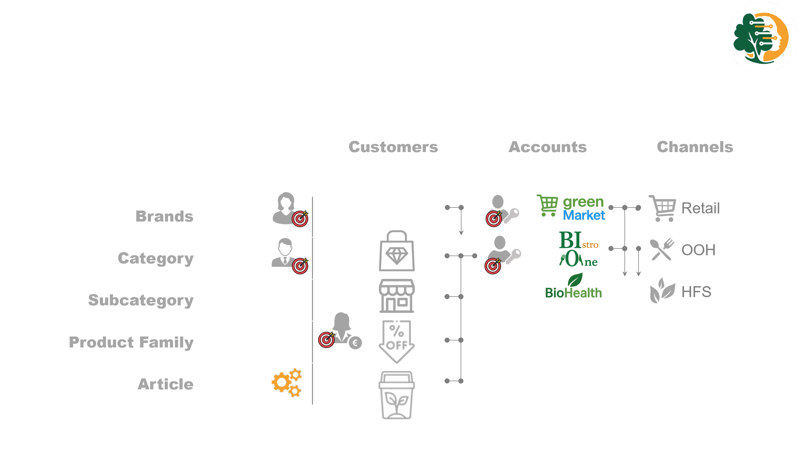

# Business Understanding {#sec-11-business-understanding}


::: {#fig-11-bu-why .figure}
::: {.content-visible when-format="html"} 
<video
  src="../video/bu_why.mp4"
  controls
  autoplay muted loop
  width="640"
  playsinline> 
</video> 
::: 
::: {.content-visible when-format="pdf"}
<!-- this block only appears in PDF output -->
  {caption="Why is forecasting important? It drives the business."
fig-align="left" fig-width="15cm"} 
:::

Why forecasting? The forecast drives the business! 
:::

#### Deliver 

Similar to many other products, *Blossam* tea is sold through different
channels with distinct **shelf-life expectations:**

-   Premium retailers demand a shelf life of over 180 days, in exchange
    for higher margins.\
-   Discount retailers may accept shorter shelf lives (e.g., 60 days),
    but at the cost of profitability.

Exceeding shelf-life constraints—whether by producing too early or
misjudging demand—can lead to:

-   **Out-Of-Stocks (OOS)**: causing lost sales, penalties, or even de-listing by key retailers.

-   **Out-Of-Date (OOD)**: leading to product waste from scrapping expired inventory.


These challenges are not unique to *Blossam* tea — they reflect broader
dynamics across the product portfolio. 


## Who uses the forecasts? {#sec-11-stakeholder}
<!-- stakeholders. -->

The company's forecasting requirements vary significantly across several
key use cases, details in [@sec-appendix-usecases]:

1.  **Buying and Production**: The Central Sourcing team requires forecasts 
    at **article level**, aggregated weekly, with a forecast
    horizon of **12 weeks** to share with production and external suppliers.

2.  **Production Cost Calculation**: Finance requires forecasts at a 
    at **article level**, aggregated quarterly, with a forecast
    horizon of **6 quarters**, grouped into annual time buckets in order to
    calculate the transfer price of articles produced.
    
3.  **Setting Safety Stock Profiles**: The Supply-Planners require forecasts 
    at the **article * warehouse**, aggregated weekly, with a
    forecast horizon of **26-52 weeks**, to determine safety stock
    profiles based on realized forecast accuracy, lead times and delivery
    performance (On-Time-In-Full).

::: {#fig-11-bu-who .figure}
::: {.content-visible when-format="html"} 
<video
  src="../video/bu_who.mp4"
  controls
  autoplay muted loop
  width="640"
  playsinline> 
</video> 
::: 
::: {.content-visible when-format="pdf"}
<!-- this block only appears in PDF output -->
  {caption="Why is forecasting important? "
fig-align="left" fig-width="15cm"} 
:::

who uses the forecasts? many different roles for different use-cases. 
:::

4.  **Material Requirement Planning**: The MRP system requires forecasts at a 
    **article * warehouse**, aggregated weekly, with a
    forecast horizon of **104 weeks**, to generate purchase orders and
    production orders.

5.  **Marketing and Sales strategies**: Category and Brand managers require 
    forecasts at a **monthly level**, aggregated by **Brand or category**, with a 
    horizon of **12 months** to plan marketing and sales strategies.

6.  **Negotiation with Customers**: Key Account Managers require forecasts at a 
    **monthly level**, aggregated by **categories * key account**, with a 
    horizon of **6 months**.

7.  **Sales Target Setting**: Sales directors require forecasts at a
    **monthly level**, aggregated by **Brand/Categories * key account**, with a 
    horizon of **12 months** to set sales targets for the next year.
    


<!-- main indicators, KPIs, constraints -->
Success will be measured by the following criteria:

Forecast Accuracy % and Bias %

To assess forecast accuracy, we will use a range of evaluation metrics
tailored to each use case.

These metrics will help evaluate how well each approach performs against
the unique requirements of each use case, ultimately guiding method
selection and refinement.

-   **RMSE (Root Mean Squared Error, @def-RMSE )**: The primary metric
    for measuring forecast accuracy, particularly useful for penalizing
    large errors.

-   **MAPE (Mean Absolute Percentage Error)**: To align with existing
    company metrics.

-   **MAE (Mean Absolute Error)** and **MASE (Mean Absolute Scaled
    Error)**: Additional metrics to provide a broader evaluation,
    addressing different aspects of forecast performance and comparing
    models to naïve baselines.


1.  **Improved Forecast Accuracy Target**:
    -   **Tailored Forecasts for Each Use Case**: Enhanced accuracy
        across areas such as buying, production, safety stock settings,
        and customer negotiations, using methods that account for
        seasonality, promotions, and varying aggregation levels.
    -   **Reduced Forecast Errors and Bias**: Measurable reductions in
        key error metrics like RMSE , MAPE , and BIAS will lead to
        better alignment between forecasted and actual sales. Increased
        accuracy will also foster trust among supply planners, reducing
        the need for excessive safety margins.
2.  **Selecting the Right Forecasting Methods**: This research will
        guide the selection of optimal exponential smoothing methods (simple,
        double or triple) to improve performance across various use cases.
3.  **Consistency Across Aggregation Levels**: Forecasts will remain
        consistent across different levels of aggregation, ensuring that
        detailed and aggregated forecasts are aligned.
        


## traditional statistical forecasting methods 


```{r}
#| label: tab-forecasting-methods
#| echo: false
#| include: true

library(data.table)
library(kableExtra)

# 1) Create a data.table to hold the table data
dt_methods <- data.table(
  Method = c(
    "Moving Average",
    "Simple Exponential Smoothing",
    "Double Exponential Smoothing",
    "Triple Exponential Smoothing",
    "Box-Jenkins (ARIMA/ARMA)"
  ),
  Challenge = c(
    "Seasonality, promotional effects",
    "Seasonality, promotional effects",
    "Seasonality, promotional effects",
    "promotional effects",
    "Stationary data"
  )
)

# 2) Wrap the Method column in cell_spec(bold = TRUE)
dt_methods[, Method := cell_spec(Method, bold = TRUE)]

# 3) Render with kableExtra, disabling escaping so the <b> and \textbf{} get through
dt_methods %>%
  kbl(
    caption = "Traditional statistical forecasting methods",
    booktabs = TRUE,
    escape = FALSE,
    format = if (knitr::is_latex_output()) "latex" else "html"
  ) %>%
  kable_styling(
    bootstrap_options = c("striped", "condensed"),
    latex_options     = c("striped", "hold_position"),
    full_width        = FALSE
  )
```

-   **Proposed Methods**:

    -   **ETS (Error, Trend, Seasonal)**: To enhance exponential
        smoothing with an automated model which selects the appropriate
        exponential smoothing model with the right parameters and provides
        **prediction intervals**.

    -   **HTS (Hierarchical Time Series)**: To handle multiple
        aggregation levels, ensuring **forecast consistency** when
        forecasts are disaggregated or aggregated across levels.


## Defining the Scope of the ML Application

##Success Criteria - Business Success purpose and success criteria (reduction OOS&OOD) and other factors like customer & employee satisfaction - ML Success FA% and BIAS% - Economic Success impact of the project on the companies financial performance DAPS \## Feasibility availability, size, and quality of the training sample

### Background

The company's forecasting requirements vary significantly across several key use cases, among others:

```{r convert‐diagram, include=FALSE}
# make sure you have installed: install.packages("rsvg")
rsvg::rsvg_png(
  svg  = "../images/scn.svg",
  file   = "../images/scn.png",
  width  = 800     # adjust width / height or res as needed
)
```

::: {.content-visible when-format="html"}
{fig-alt="Supply Chain Network" fig-align="center" fig-width="15cm"}
:::


::: {.content-visible when-format="pdf"}
{fig-alt="Supply Chain Network" fig-align="center" fig-width="5cm"}
:::


1.  **Buying and Production**: Requires forecasts at the **material level** and **warehouse**, aggregated weekly, with a forecast horizon of **12 weeks**.

2.  **Setting Safety Stock Profiles**: Requires forecasts at the **material level** and **warehouse**, aggregated weekly, with a forecast horizon of **26-52 weeks**, to determine safety stock profiles based on realized forecast accuracy.

3.  **Negotiation with Customers**: Requires forecasts at a **monthly level**, aggregated by **material categories** and **customer groups**, with a horizon of **6 months**.

4.  **Production Cost Calculation**: Requires forecasts at a **quarterly level**, aggregated by material, with a horizon of **6 quarters**, grouped into annual time buckets.

The primary forecasting challenge is determining the optimal aggregation level and methods to use for generating forecasts that can meet the desired forecast accuracy of these different use cases while ensuring **consistency** and **accuracy**.

This inconsistency stems from a lack of objective criteria for selecting between forecasting methods—**bottom-up**, **top-down**, or **middle-out**—resulting in decisions that rely on the subjective judgment of demand planners, leading to variable performance and inefficiencies.

### Business Objectives

The primary objective is to enhance operational efficiency by improving forecast accuracy across all key use cases. This will be achieved through the application of robust forecasting methods that can handle seasonality, promotions, and efficiently allocate scarce resources. Ultimately, these improvements will contribute to improved stock levels and a higher level of customer satisfaction, both key strategic goals for the company.

### Business Success Criteria

Success will be measured by the following criteria:

1.  **Improved Forecast Accuracy**:
    -   **Tailored Forecasts for Each Use Case**: Enhanced accuracy across areas such as buying, production, safety stock settings, and customer negotiations, using methods that account for seasonality, promotions, and varying aggregation levels.
    -   **Reduced Forecast Errors and Bias**: Measurable reductions in key error metrics like RMSE , MAPE , and BIAS will lead to better alignment between forecasted and actual sales. Increased accuracy will also foster trust among supply planners, reducing the need for excessive safety margins.
    -   **Consistency Across Aggregation Levels**: Forecasts will remain consistent across different levels of aggregation, ensuring that detailed and aggregated forecasts are aligned.
2.  **Informed Decision-Making for Forecasting System Functionality**:
    -   **Selecting the Right Forecasting Methods**: This research will guide the selection of optimal forecasting methods (statistical, machine learning, or hybrid) to improve performance across various use cases.
    -   **Efficient Resource Allocation**: A product classification scheme (e.g., ABC-XYZ) will be developed to help demand planners focus on high-impact products, while low-impact products will be managed more efficiently through automated forecasts.
3.  **Operational Benefits**:
    -   **Improved Inventory Management**: More accurate forecasts will drive better purchasing and production decisions, leading to:
        -   **Reduced Out-of-Stock (OOS) Incidents**: Ensuring product availability to meet customer demand and reduce penalties from stock-outs.
        -   **Reduced Out-of-Date (OOD) Incidents**: Minimizing waste and ensuring the freshness of perishable goods, leading to lower storage costs and better inventory turnover.
    -   **Optimized Safety Stock Levels**: Accurate forecasts will allow for better safety stock settings, reducing both overstocking and stock-outs.
    -   **Cost Optimization**: Improved demand alignment will lower excess inventory and warehousing costs, minimize spoilage, and reduce costs associated with last-minute adjustments and overproduction.
4.  **Enhanced Supply Chain Efficiency and Decision-Making**:
    -   **Strategic Decision Support**: Consistent and accurate forecasts will improve decision-making across production planning, sales target setting, capacity management, and workforce optimization. These improvements will also support better customer negotiations and more precise COGS (Cost of Goods Sold) calculations, resulting in a more efficient supply chain.
    -   **Increased Customer Satisfaction**: Improved product availability, fewer stock-outs, and fresher goods will not only reduce operational costs but will also enhance customer satisfaction and loyalty—a core strategic objective of the company.

By achieving these objectives, the company will see significant improvements in operational efficiency, cost-effectiveness, and most importantly, a higher level of customer satisfaction, which will ultimately drive long-term business success.

see upper part of the flow-down graph, (@sec-flowdown).

### Inventory of Resources Requirements

#### Data sources:

The available data includes **historical sales**, **promotional data**, **stock quantities**, and **previous forecasts**. Stock-out periods will be adjusted for by inflating sales to reflect demand that would have occurred had stock been available.

| Data Type | Details | Time Span |
|------------------------|------------------------|:-----------------------|
| Sales | Customer Orders, Inter-company, Returns, Free-of-Charge and Missed | \> 2020 |
| Promotions | Promotions per material and customer | \> 2020 |
| Stock | Daily stock level per material and distribution center | \> 2020 |
| Forecasts | generated forecast before- and after Demand Review | \> Aug. 2023 |
| Master data | Material, Customer and Organization, including hierarchy's | *N.A.* |

<!-- : (see, data_sources for details) -->

#### Scoping

The scope of the project consist of two Marketing & Sales Organizations (MSO), with a focus on 6 brands, representing 5 out of the 6 categories, see @tbl-material-scope. These materials are made-to-stock (MTS), requirements are planned on a weekly level, which represents 97% of the business.

This leaves us with about 1.000 materials out of 9.000 to focus on, making the assumption that these are representative for the rest of the products.

| Brand     | Category          |
|:----------|:------------------|
| Bjorg     | Dairy             |
| Clipper   | Tea / Coffee      |
| Naturela  | Tea / Coffee      |
| Tanoshi   | Meals             |
| Alter Eco | Sweets            |
| Zonnatura | Breakfast Cereals |

: Brands and Categories {#tbl-material-scope}

<!-- see @sec-project-charter -->

<!-- #### Risks and Contingencies -->

<!-- see @sec-project-charter -->

<!-- #### Terminology -->

<!-- #### Costs and Benefits -->

<!-- Business Case? -->

### Data Mining Goals

Predictive Model based on Correlations: Forecast Future Sales + Promotion effects

see lower part of the flow-down graph, (@sec-flowdown).

#### Data and Forecasting Methods {.unnumbered}

We will employ a combination of **statistical methods** and **machine learning techniques** to improve the forecasting process:

-   **Current Methods**: The company’s current forecasting system uses **moving averages**, **exponential smoothing** and **Box-Jenkins**, which face challenges with **Seasonality**, **Stationarity** and **promotional effects**. Forecasts are often inadequate in handling the impacts of promotions.

-   **Proposed Methods**:

    -   **ETS (Error, Trend, Seasonal)**: To replace exponential smoothing with a model that provides **prediction intervals** and better captures trends and seasonality.

    -   **HTS (Hierarchical Time Series)**: To handle multiple aggregation levels, ensuring **forecast consistency** when forecasts are disaggregated or aggregated across levels.

    -   **XGBoost**: A machine learning technique capable of handling **promotional impacts** and even identifying **cannibalization effects** of promotions between products.

    -   **conformal prediction**: A method that provides **prediction intervals** and **calibrated forecasts**, ensuring that the forecasted values are within a certain confidence level.

    -   **CatBoost and SHAP**: These will be used for feature analysis, determining which features (e.g., promotions, stock-outs) have the highest impact on forecast accuracy. This approach helps in choosing relevant input features to improve forecasts.

#### Consistency and Validation {.unnumbered}

One key requirement is ensuring that forecasts remain consistent across different levels of aggregation. This is where **HTS** will play a crucial role, reconciling forecasts generated at different aggregation levels to ensure that top-level forecasts align with aggregated lower-level forecasts. This will address the known issue of discrepancies between aggregated forecasts and directly forecasted aggregated levels.

#### **Human Resources Allocation**

The team consists of **X demand planners** working across **Y MSOs**. Currently, planners are involved in manually indicating promotional impacts and adjusting forecasts based on intuition, without systematic data cleaning for stock-outs or model tuning.

To optimize resource allocation, we plan to implement a **classification system** for the company's **9K SKUs**, utilizing an:

**ABC-XYZ classification** scheme:

-   **ABC Classification**: Based on **sales volume**—focusing more resources on high-value items (A-class) and minimizing attention to low-volume items (C-class).
-   **XYZ Classification**: Based on **sales variability**, indicating which products have stable demand versus those with erratic patterns.
-   **Combined Classification**: These classifications will guide planners in determining where their efforts can have the most impact, focusing primarily on high-priority items while relying more on automated processes for low-priority ones.

### Data Mining Success Criteria

The fiinal result will show an estimated relationship between forecast accuracy and the cost of resources required for the agreed scope. The cost of resources result from hardware, software and human resources needed for cleansing data, transforming data, model tuning and other manual activities needed.

To assess forecast accuracy, we will use a range of evaluation metrics tailored to each use case.

These metrics will help evaluate how well each approach performs against the unique requirements of each use case, ultimately guiding method selection and refinement.

-   **RMSE (Root Mean Squared Error, @def-RMSE )**: The primary metric for measuring forecast accuracy, particularly useful for penalizing large errors.

-   **MAPE (Mean Absolute Percentage Error)**: To align with existing company metrics.

-   **MAE (Mean Absolute Error)** and **MASE (Mean Absolute Scaled Error)**: Additional metrics to provide a broader evaluation, addressing different aspects of forecast performance and comparing models to naïve baselines.

### Project Plan

see @sec-project-plan

#### Initial Assessment of Tools and Techniques

```{r}
#| label: gt table2
#| eval: false
#| echo: false
#| include: true
#| fold: true

# example gt table
mtcars[1:6, 1:6] |>
  gt(rowname_col = "model") |>
  tab_header(
    title = md("**First 6 Cars**"),
    subtitle = "A small gt demo"
  ) |>
  data_color(
    columns = vars(mpg, hp),
    colors = scales::col_numeric(
      palette = c("lightblue", "navy"),
      domain  = NULL
    )
  )


mtcars[1:8, 1:6] %>%
  gt(rowname_col = "model") %>%
  tab_header(
    title    = md("**My Branded Table**"),
    subtitle = "With a consistent gt theme"
  ) %>%
  gt_theme_pythia()


```

## Table

table4, keep
```{r}
#| label: gt-table-gt-row-groups
#| eval: true
#| echo: false
#| include: true

library(data.table)
library(gt)


#' Create GT table with proper row grouping using groupname_col
#'
#' @param shipments_data A data.table with shipment data
#' @return A gt table object with proper row groups
#' @export
create_grouped_table <- function(shipments_data) {
  
  # 1) Summarize data
  summary_dt <- shipments_data[
    , .(count     = .N,
        avg_items = mean(items),
        max_items = max(items)),
    by = .(origin, destination)
  ]
  
  # 2) Create separate data.tables for each metric
  count_dt <- summary_dt[, .(origin, destination, metric = "Count (n)", value = count)]
  avg_dt <- summary_dt[, .(origin, destination, metric = "Average Items", value = round(avg_items, 1))]
  max_dt <- summary_dt[, .(origin, destination, metric = "Max Items", value = max_items)]
  
  # 3) Combine all metrics
  long_dt <- rbind(count_dt, avg_dt, max_dt)
  
  # 4) Add metric order for proper sorting
  long_dt[, metric_order := fcase(
    metric == "Count (n)", 1,
    metric == "Average Items", 2,
    metric == "Max Items", 3
  )]
  
  # 5) Pivot to wide format
  wide_dt <- dcast(
    long_dt,
    origin + metric + metric_order ~ destination,
    value.var = "value"
  )
  
  # 6) Order properly
  setorder(wide_dt, origin, metric_order)
  
  # 7) Get destination columns
  dest_cols <- setdiff(names(wide_dt), c("origin", "metric", "metric_order"))
  
  # 8) Select and reorder columns for GT
  final_dt <- wide_dt[, .SD, .SDcols = c("origin", "metric", dest_cols)]
  
  return(final_dt)
}
```

```{r}
#| label: gt-table-with-grouping
#| eval: true
#| echo: false
#| include: true

library(data.table)
library(gt)
library(magrittr)

shipments <- fread("C:/Users/flori/OneDrive/ET/pythia/data/scn_pythia.csv") %T>%
  setnames(
    c("from"  , "to"         , "N"),
    c("origin", "destination", "items"))

# 1) Simulate shipment data
# set.seed(42)
# shipments <- data.table(
#   origin      = sample(c("USA","China","Germany"), 200, TRUE),
#   destination = sample(c("USA","China","Germany"), 200, TRUE),
#   items       = rpois(200, lambda = 10)
# )

# 2) Create the processed data
table_data <- create_grouped_table(shipments)

# 3) Get destination columns dynamically
dest_cols <- setdiff(names(table_data), c("origin", "metric"))

# 4) Create GT table using groupname_col
table_data %>%
  gt(groupname_col = "origin") %>%  # This creates the row groups automatically!
  cols_label(
    metric = "Metric"
  ) %>%
  tab_spanner(
    label = "TO",
    columns = all_of(dest_cols)
  ) %>%
  # Format the average items with 1 decimal
  fmt_number(
    columns = all_of(dest_cols),
    rows = metric == "Average Items",
    decimals = 1
  ) %>%
  # Format count and max as integers
  fmt_number(
    columns = all_of(dest_cols),
    rows = metric != "Average Items",
    decimals = 0
  ) %>%
  # Make the max items bold
  tab_style(
    style = cell_text(weight = "bold"),
    locations = cells_body(
      columns = all_of(dest_cols),
      rows = metric == "Max Items"
    )
  ) %>%
  # Style the metric column
  tab_style(
    style = cell_text(style = "italic", size = px(12)),
    locations = cells_body(columns = "metric")
  ) %>%
  # Style the row group headers (origin labels)
  tab_style(
    style = cell_text(weight = "bold", size = px(14)),
    locations = cells_row_groups()
  ) %>%
  # Add some spacing between groups
  tab_style(
    style = cell_borders(
      sides = "top",
      color = "#666666",
      weight = px(2)
    ),
    locations = cells_row_groups()
  ) %>%
  tab_header(
    title = "Shipments by Origin → Destination",
    subtitle = "Metrics grouped by origin using GT row groups"
  ) %>%
  opt_row_striping() %>%
  cols_align("left", columns = "metric") %>%
  cols_align("center", columns = all_of(dest_cols)) %>%
  cols_width(
    metric ~ px(120),
    everything() ~ px(80)
  )
```

table5, delete?
```{r}
#| label: gt-table-explicit-manual-grouping
#| eval: true
#| echo: false
#| include: true

library(data.table)
library(gt)
library(magrittr)

shipments <- fread("C:/Users/flori/OneDrive/ET/pythia/data/scn_pythia.csv") %T>%
  setnames(
    c("from"  , "to"         , "N"),
    c("origin", "destination", "items"))

# 2) Summarize using data.table
summary_dt <- shipments[
  , .(count     = .N,
      avg_items = mean(items),
      max_items = max(items)),
  by = .(origin, destination)
]

# 3) Create metrics in long format
all_metrics <- rbindlist(list(
  summary_dt[, .(origin, destination, metric = "Count (n)", value = count, metric_order = 1L)],
  summary_dt[, .(origin, destination, metric = "Average Items", value = round(avg_items, 1), metric_order = 2L)],
  summary_dt[, .(origin, destination, metric = "Max Items", value = max_items, metric_order = 3L)]
))

# 4) Sort the data using data.table
setorder(all_metrics, origin, metric_order)

# 5) Pivot to wide format using data.table
wide_dt <- dcast(
  all_metrics,
  origin + metric + metric_order ~ destination,
  value.var = "value"
)

# 6) Identify destination columns using data.table operations
all_columns <- names(wide_dt)
control_columns <- c("origin", "metric", "metric_order")
destination_columns <- all_columns[!all_columns %in% control_columns]

# 7) Prepare data for GT - exclude origin column using data.table
gt_input <- wide_dt[, .SD, .SDcols = c("metric", "metric_order", destination_columns)]

# 8) Remove metric_order column for final display
display_columns <- c("metric", destination_columns)
final_gt_data <- gt_input[, .SD, .SDcols = display_columns]

# 9) Create GT table
gt_result <- final_gt_data %>% gt()

# 10) Add row groups manually using data.table to find positions
unique_origins <- unique(wide_dt$origin)

for (current_origin in unique_origins) {
  # Find row indices for this origin using data.table
  matching_rows <- which(wide_dt$origin == current_origin)
  
  # Add the row group
  gt_result <- gt_result %>%
    tab_row_group(
      label = current_origin,
      rows = matching_rows
    )
}

# 11) Apply styling and formatting
gt_result %>%
  cols_label(
    metric = "Metric"
  ) %>%
  tab_spanner(
    label = "TO",
    columns = all_of(destination_columns)
  ) %>%
  # Format average items with 1 decimal place
  fmt_number(
    columns = all_of(destination_columns),
    rows = metric == "Average Items",
    decimals = 1
  ) %>%
  # Format other metrics as integers
  fmt_number(
    columns = all_of(destination_columns),
    rows = metric %in% c("Count (n)", "Max Items"),
    decimals = 0
  ) %>%
  # Bold the max items
  tab_style(
    style = cell_text(weight = "bold"),
    locations = cells_body(
      columns = all_of(destination_columns),
      rows = metric == "Max Items"
    )
  ) %>%
  # Style metric column
  tab_style(
    style = cell_text(style = "italic", size = px(12)),
    locations = cells_body(columns = "metric")
  ) %>%
  # Style row group headers
  tab_style(
    style = list(
      cell_text(weight = "bold", size = px(14)),
      cell_fill(color = "#f8f9fa")
    ),
    locations = cells_row_groups()
  ) %>%
  # Add borders between row groups
  tab_style(
    style = cell_borders(
      sides = "top",
      color = "#666666",
      weight = px(2)
    ),
    locations = cells_row_groups()
  ) %>%
  # Add subtle right border to metric column
  tab_style(
    style = cell_borders(
      sides = "right",
      color = "#e0e0e0",
      weight = px(1)
    ),
    locations = cells_body(columns = "metric")
  ) %>%
  tab_style(
    style = cell_borders(
      sides = "right",
      color = "#e0e0e0",
      weight = px(1)
    ),
    locations = cells_column_labels(columns = "metric")
  ) %>%
  tab_header(
    title = "Shipments by Origin → Destination",
    subtitle = "Manual row grouping with pure data.table syntax"
  ) %>%
  # Table options for row groups
  tab_options(
    row_group.border.top.style = "solid",
    row_group.border.top.width = px(2),
    row_group.border.top.color = "#666666",
    row_group.padding = px(6)
  ) %>%
  opt_row_striping() %>%
  cols_align("left", columns = "metric") %>%
  cols_align("center", columns = all_of(destination_columns)) %>%
  cols_width(
    metric ~ px(120),
    everything() ~ px(80)
  )
```

table6, delete?
```{r}
#| label: gt-left-column-grouping
#| eval: true
#| echo: false
#| include: true

library(data.table)
library(gt)
library(magrittr)

#' Create table with origin column on the left (like your original approach)
#'
#' @param shipments_data A data.table with shipment data
#' @return A gt table object with left-side grouping
#' @export
create_left_grouped_table <- function(shipments_data) {
  
  # 1) Summarize data
  summary_dt <- shipments_data[
    , .(count     = .N,
        avg_items = mean(items),
        max_items = max(items)),
    by = .(origin, destination)
  ]
  
  # 2) Create metrics in long format
  all_metrics <- rbindlist(list(
    summary_dt[, .(origin, destination, metric = "Count (n)", value = count, metric_order = 1L)],
    summary_dt[, .(origin, destination, metric = "Average Items", value = round(avg_items, 1), metric_order = 2L)],
    summary_dt[, .(origin, destination, metric = "Max Items", value = max_items, metric_order = 3L)]
  ))
  
  # 3) Sort the data
  setorder(all_metrics, origin, metric_order)
  
  # 4) Pivot to wide format
  wide_dt <- dcast(
    all_metrics,
    origin + metric + metric_order ~ destination,
    value.var = "value"
  )
  
  # 5) Create origin display column (show only once per group)
  wide_dt[, origin_display := ""]
  wide_dt[, is_first_in_group := !duplicated(origin)]
  wide_dt[is_first_in_group == TRUE, origin_display := as.character(origin)]
  
  return(wide_dt)
}

shipments <- fread("C:/Users/flori/OneDrive/ET/pythia/data/scn_pythia.csv") %T>%
  setnames(
    c("from"  , "to"         , "N"),
    c("origin", "destination", "items"))

# 2) Create the data with left-side grouping
table_data <- create_left_grouped_table(shipments)

# 3) Get destination columns
dest_cols <- setdiff(names(table_data), c("origin", "metric", "metric_order", "origin_display", "is_first_in_group"))

# 4) Create display data
display_data <- table_data[, .SD, .SDcols = c("origin_display", "metric", dest_cols)]

# 5) Create GT table
display_data %>%
  gt() %>%
  cols_label(
    origin_display = "FROM",
    metric = "Metric"
  ) %>%
  tab_spanner(
    label = "TO",
    columns = all_of(dest_cols)
  ) %>%
  # Format numbers
  fmt_number(
    columns = all_of(dest_cols),
    rows = metric == "Average Items",
    decimals = 1
  ) %>%
  fmt_number(
    columns = all_of(dest_cols),
    rows = metric != "Average Items",
    decimals = 0
  ) %>%
  # Bold max items
  tab_style(
    style = cell_text(weight = "bold"),
    locations = cells_body(
      columns = all_of(dest_cols),
      rows = metric == "Max Items"
    )
  ) %>%
  # Style the FROM column - make non-empty cells bold and larger
  tab_style(
    style = cell_text(weight = "bold", size = px(14)),
    locations = cells_body(
      columns = "origin_display",
      rows = origin_display != ""
    )
  ) %>%
  # Add vertical line to separate grouping from metrics
  tab_style(
    style = cell_borders(
      sides = "right",
      color = "#666666",
      weight = px(2)
    ),
    locations = cells_body(columns = "origin_display")
  ) %>%
  tab_style(
    style = cell_borders(
      sides = "right",
      color = "#666666",
      weight = px(2)
    ),
    locations = cells_column_labels(columns = "origin_display")
  ) %>%
  # Add subtle right border to metric column
  tab_style(
    style = cell_borders(
      sides = "right",
      color = "#cccccc",
      weight = px(1)
    ),
    locations = cells_body(columns = "metric")
  ) %>%
  tab_style(
    style = cell_borders(
      sides = "right",
      color = "#cccccc",
      weight = px(1)
    ),
    locations = cells_column_labels(columns = "metric")
  ) %>%
  # Add horizontal borders to separate origin groups
  tab_style(
    style = cell_borders(
      sides = "top",
      color = "#999999",
      weight = px(1)
    ),
    locations = cells_body(
      rows = metric == "Count (n)" & origin_display != ""
    )
  ) %>%
  # Style metric column
  tab_style(
    style = cell_text(style = "italic", size = px(12)),
    locations = cells_body(columns = "metric")
  ) %>%
  tab_header(
    title = "Shipments by Origin → Destination",
    subtitle = "Origin grouping displayed in left column"
  ) %>%
  opt_row_striping() %>%
  cols_align("left", columns = c("origin_display", "metric")) %>%
  cols_align("center", columns = all_of(dest_cols)) %>%
  cols_width(
    origin_display ~ px(80),
    metric ~ px(120),
    everything() ~ px(80)
  )
```

### hybrid grouping
```{r}
#| label: gt-hybrid-grouping
#| eval: true
#| echo: false
#| include: true

library(data.table)
library(gt)
library(magrittr)

# Create the same data as Method 2
table_data <- create_left_grouped_table(shipments)
dest_cols <- setdiff(names(table_data), c("origin", "metric", "metric_order", "origin_display", "is_first_in_group"))
display_data <- table_data[, .SD, .SDcols = c("origin_display", "metric", dest_cols)]

# Create GT table with enhanced visual grouping
display_data %>%
  gt() %>%
  cols_label(
    origin_display = "FROM",
    metric = "Metric"
  ) %>%
  tab_spanner(
    label = "TO", 
    columns = all_of(dest_cols)
  ) %>%
  # Format numbers
  fmt_number(
    columns = all_of(dest_cols),
    rows = metric == "Average Items",
    decimals = 1
  ) %>%
  fmt_number(
    columns = all_of(dest_cols),
    rows = metric != "Average Items", 
    decimals = 0
  ) %>%
  # Make origin cells with content stand out more
  tab_style(
    style = list(
      cell_text(weight = "bold", size = px(14), color = "#2c3e50"),
      cell_fill(color = "#ecf0f1")
    ),
    locations = cells_body(
      columns = "origin_display",
      rows = origin_display != ""
    )
  ) %>%
  # Add thick left border to origin groups
  tab_style(
    style = cell_borders(
      sides = "left",
      color = "#0f5e3c",
      weight = px(4)
    ),
    locations = cells_body(
      columns = "origin_display",
      rows = origin_display != ""
    )
  ) %>%
  # Extend the left border to the entire row for visual continuity
  tab_style(
    style = cell_borders(
      sides = "left",
      color = "#0f5e3c", 
      weight = px(2)
    ),
    locations = cells_body(
      rows = origin_display == ""
    )
  ) %>%
  # Bold max items
  tab_style(
    style = cell_text(weight = "bold"),
    locations = cells_body(
      columns = all_of(dest_cols),
      rows = metric == "Average Items"
    )
  ) %>%
  # Right border after FROM column
  tab_style(
    style = cell_borders(
      sides = "right",
      color = "#7f8c8d",
      weight = px(2)
    ),
    locations = cells_body(columns = "origin_display")
  ) %>%
  tab_style(
    style = cell_borders(
      sides = "right", 
      color = "#7f8c8d",
      weight = px(2)
    ),
    locations = cells_column_labels(columns = "origin_display")
  ) %>%
  tab_header(
    title = "Shipments by Origin → Destination",
    subtitle = "Enhanced left-column grouping with visual indicators"
  ) %>%
  opt_row_striping() %>%
  cols_align("center", columns = c("origin_display", "metric")) %>%
  cols_align("center", columns = all_of(dest_cols)) %>%
  cols_width(
    origin_display ~ px(80),
    metric ~ px(120),
    everything() ~ px(80)
  )
```

# GGPlots

```{r}
#| label: lead-time-distribution-table
#| eval: false
#| echo: false
#| include: true

library(data.table)
library(gt)
library(ggplot2)
library(purrr)
library(magrittr)

#' Create table with embedded lead time distribution plots
#'
#' @param data A data.table with category and lead_time columns
#' @return A gt table object with embedded distribution plots
#' @export
create_leadtime_distribution_table <- function(data) {
  
  # 1) Calculate comprehensive statistics by category
  summary_stats <- data[
    , .(
        count = .N,
        mean_lt = round(mean(lead_time), 1),
        median_lt = round(median(lead_time), 1),
        sd_lt = round(sd(lead_time), 1),
        min_lt = round(min(lead_time), 1),
        max_lt = round(max(lead_time), 1),
        p95_lt = round(quantile(lead_time, 0.95), 1)
      ),
    by = category
  ][order(mean_lt)]  # Order by mean lead time
  
  # 2) Create mini distribution plots
  create_distribution_plot <- function(cat) {
    cat_data <- data[category == cat]
    
    # Create a clean, minimal plot
    p <- ggplot(cat_data, aes(x = lead_time)) +
      geom_density(fill = "#3498db", alpha = 0.6, color = "#2980b9", linewidth = 0.8) +
      geom_vline(aes(xintercept = mean(lead_time)), 
                 color = "#e74c3c", linewidth = 1, linetype = "dashed") +
      geom_vline(aes(xintercept = median(lead_time)), 
                 color = "#f39c12", linewidth = 1, linetype = "dotted") +
      theme_void() +
      theme(
        plot.background = element_rect(fill = "transparent", color = NA),
        panel.background = element_rect(fill = "transparent", color = NA),
        plot.margin = margin(3, 3, 3, 3, "pt")
      ) +
      scale_x_continuous(expand = c(0.02, 0.02)) +
      scale_y_continuous(expand = c(0.02, 0.02))
    
    # Save as temporary PNG
    temp_file <- tempfile(fileext = ".png")
    ggsave(temp_file, plot = p, width = 2.5, height = 1, dpi = 200, bg = "transparent")
    
    return(temp_file)
  }
  
  # 3) Generate plot files for each category
  summary_stats[, plot_file := sapply(category, create_distribution_plot)]
  
  # 4) Create the GT table
  summary_stats %>%
    gt() %>%
    # Transform plot paths to images
    text_transform(
      locations = cells_body(columns = "plot_file"),
      fn = function(x) {
        map_chr(x, ~ local_image(.x, height = 50))
      }
    ) %>%
    # Column labels
    cols_label(
      category = "Category",
      count = "Count",
      mean_lt = "Mean",
      median_lt = "Median",
      sd_lt = "Std Dev",
      min_lt = "Min",
      max_lt = "Max", 
      p95_lt = "95th %ile",
      plot_file = "Distribution"
    ) %>%
    # Formatting
    fmt_number(
      columns = c("mean_lt", "median_lt", "sd_lt", "min_lt", "max_lt", "p95_lt"),
      decimals = 1
    ) %>%
    fmt_number(
      columns = "count",
      decimals = 0
    ) %>%
    # Styling
    tab_style(
      style = cell_text(weight = "bold"),
      locations = cells_body(columns = "category")
    ) %>%
    tab_style(
      style = cell_borders(
        sides = "right",
        color = "#e0e0e0",
        weight = px(1)
      ),
      locations = cells_body(columns = c("category", "count"))
    ) %>%
    tab_style(
      style = cell_borders(
        sides = "right",
        color = "#e0e0e0", 
        weight = px(1)
      ),
      locations = cells_column_labels(columns = c("category", "count"))
    ) %>%
    # Header and options
    tab_header(
      title = "Lead Time Analysis by Category",
      subtitle = md("Distribution plots showing **mean** (red dashed) and **median** (orange dotted) lines")
    ) %>%
    tab_footnote(
      footnote = "Categories ordered by mean lead time (ascending)",
      locations = cells_column_labels(columns = "category")
    ) %>%
    # Layout
    cols_align("left", columns = "category") %>%
    cols_align("center", columns = -c("category", "plot_file")) %>%
    cols_align("center", columns = "plot_file") %>%
    cols_width(
      category ~ px(100),
      count ~ px(60),
      mean_lt ~ px(60),
      median_lt ~ px(70),
      sd_lt ~ px(70),
      min_lt ~ px(50),
      max_lt ~ px(50),
      p95_lt ~ px(70),
      plot_file ~ px(120)
    ) %>%
    opt_row_striping() %>%
    tab_options(
      table.font.size = px(12),
      column_labels.font.weight = "bold"
    )
}


scn <- fread("C:/Users/flori/OneDrive/ET/pythia/data/scn_pythia.csv") %T>%
  setnames(
    c("PH2_T", "N"),
    c("category", "lead_time"))

# Create the table
create_leadtime_distribution_table(scn)
```

ggplot and spark

```{r}
#| label: lead-time-distribution-table_bas64_hybrid
#| eval: true
#| echo: false
#| include: true

library(data.table)
library(gt)
library(ggplot2)
library(purrr)
library(magrittr)


#' Create table with plots that work in both HTML and PDF
#'
#' @param data A data.table with category and lead_time columns
#' @return A gt table object with format-appropriate visualizations
#' @export
create_universal_distribution_table <- function(data) {
  
  # 1) Calculate comprehensive statistics by category
  summary_stats <- data[
    , .(
        count = .N,
        mean_lt = round(mean(lead_time), 1),
        median_lt = round(median(lead_time), 1),
        sd_lt = round(sd(lead_time), 1),
        min_lt = round(min(lead_time), 1),
        max_lt = round(max(lead_time), 1),
        p95_lt = round(quantile(lead_time, 0.95), 1)
      ),
    by = category
  ][order(mean_lt)]
  
  # 2) Detect output format and create appropriate visualization
  if (knitr::is_latex_output()) {
    # For PDF: Use enhanced Unicode sparklines
    summary_stats[, visualization := {
      sapply(category, function(cat) {
        cat_data <- data[category == cat, lead_time]
        
        # Create histogram
        hist_data <- hist(cat_data, breaks = 12, plot = FALSE)
        counts <- hist_data$counts
        
        if (max(counts) > 0) {
          normalized <- pmax(1, round(8 * counts / max(counts)))
        } else {
          normalized <- rep(1, length(counts))
        }
        
        # Enhanced characters for better PDF appearance
        chars <- c(" ", "▁", "▂", "▃", "▄", "▅", "▆", "▇", "█")
        sparkline <- paste(chars[normalized], collapse = "")
        
        # Add performance indicator
        mean_val <- mean(cat_data)
        if (mean_val < 8) {
          indicator <- " ●"  # Green equivalent
        } else if (mean_val < 12) {
          indicator <- " ◐"  # Blue equivalent
        } else if (mean_val < 16) {
          indicator <- " ◑"  # Orange equivalent  
        } else {
          indicator <- " ○"  # Red equivalent
        }
        
        paste0(sparkline, indicator)
      })
    }]
  } else {
    # For HTML: Use base64 images
    create_plot_base64 <- function(cat) {
      cat_data <- data[category == cat]
      
      # Create plot
      p <- ggplot(cat_data, aes(x = lead_time)) +
        geom_density(fill = "#3498db", alpha = 0.6, color = "#2980b9", linewidth = 0.8) +
        geom_vline(aes(xintercept = mean(lead_time)), 
                   color = "#e74c3c", linewidth = 1, linetype = "dashed") +
        geom_vline(aes(xintercept = median(lead_time)), 
                   color = "#f39c12", linewidth = 1, linetype = "dotted") +
        theme_void() +
        theme(
          plot.background = element_rect(fill = "white", color = NA),
          panel.background = element_rect(fill = "white", color = NA),
          plot.margin = margin(3, 3, 3, 3, "pt")
        ) +
        scale_x_continuous(expand = c(0.02, 0.02)) +
        scale_y_continuous(expand = c(0.02, 0.02))
      
      # Use ragg for better quality
      temp_file <- tempfile(fileext = ".png")
      ragg::agg_png(temp_file, width = 500, height = 200, res = 150, bg = "white")
      print(p)
      dev.off()
      
      # Read and encode
      img_base64 <- base64enc::base64encode(temp_file)
      file.remove(temp_file)
      
      return(paste0("data:image/png;base64,", img_base64))
    }
    
    summary_stats[, visualization := sapply(category, create_plot_base64)]
  }
  
  # 3) Create GT table with format-specific handling
  gt_table <- summary_stats %>%
    gt() %>%
    cols_label(
      category = "Category",
      count = "Count",
      mean_lt = "Mean",
      median_lt = "Median",
      sd_lt = "Std Dev",
      min_lt = "Min",
      max_lt = "Max", 
      p95_lt = "95th %ile",
      visualization = "Distribution"
    )
  
  # Apply format-specific transformations
  if (knitr::is_latex_output()) {
    # For PDF: Style as monospace text
    gt_table <- gt_table %>%
      tab_style(
        style = cell_text(font = "monospace", size = px(14), weight = "bold"),
        locations = cells_body(columns = "visualization")
      )
  } else {
    # For HTML: Embed as images
    gt_table <- gt_table %>%
      text_transform(
        locations = cells_body(columns = "visualization"),
        fn = function(x) {
          paste0('')
        }
      )
  }
  
  # Common styling
  gt_table %>%
    fmt_number(
      columns = c("mean_lt", "median_lt", "sd_lt", "min_lt", "max_lt", "p95_lt"),
      decimals = 1
    ) %>%
    fmt_number(
      columns = "count",
      decimals = 0
    ) %>%
    tab_header(
      title = "Lead Time Analysis by Category",
      subtitle = if (knitr::is_latex_output()) {
        "Sparkline distributions with performance indicators"
      } else {
        "Distribution plots with mean (red dashed) and median (orange dotted) lines"
      }
    ) %>%
    cols_align("left", columns = "category") %>%
    cols_align("center", columns = -c("category", "visualization")) %>%
    cols_width(
      category ~ px(100),
      visualization ~ px(120),
      everything() ~ px(70)
    ) %>%
    opt_row_striping()
}


scn <- fread("C:/Users/flori/OneDrive/ET/pythia/data/scn_pythia.csv") %T>%
  setnames(
    c("PH2_T", "N"),
    c("category", "lead_time"))

# Create the table
create_universal_distribution_table(scn)
```

```{r}
#| label: png-disk-distribution-table
#| eval: false
#| echo: false
#| include: true

library(data.table)
library(gt)
library(ggplot2)
library(magrittr)

#' Create distribution table with PNG files saved to disk
#'
#' @param data A data.table with category and lead_time columns
#' @param img_dir Directory to save images (default: "distribution_plots")
#' @param clean_existing Should existing images be cleaned first (default: TRUE)
#' @return A gt table object with embedded PNG distribution plots
#' @export
#' @examples
#' \dontrun{
#' library(data.table)
#' library(gt)
#' library(ggplot2)
#' 
#' # Sample data
#' dt <- data.table(
#'   category = sample(c("Electronics", "Clothing", "Books"), 1000, TRUE),
#'   lead_time = c(rnorm(333, 10, 2), rnorm(333, 15, 3), rnorm(334, 8, 1.5))
#' )
#' create_png_distribution_table(dt)
#' }
create_png_distribution_table <- function(data, img_dir = "distribution_plots", clean_existing = TRUE) {
  
  # 1) Create directory for images
  if (!dir.exists(img_dir)) {
    dir.create(img_dir, recursive = TRUE)
    message("Created directory: ", img_dir)
  }
  
  # 2) Clean existing images if requested
  if (clean_existing) {
    existing_files <- list.files(img_dir, pattern = "\\.png$", full.names = TRUE)
    if (length(existing_files) > 0) {
      file.remove(existing_files)
      message("Cleaned ", length(existing_files), " existing PNG files")
    }
  }
  
  # 3) Calculate comprehensive statistics by category
  summary_stats <- data[
    , .(
        count = .N,
        mean_lt = round(mean(lead_time), 1),
        median_lt = round(median(lead_time), 1),
        sd_lt = round(sd(lead_time), 1),
        min_lt = round(min(lead_time), 1),
        max_lt = round(max(lead_time), 1),
        q25_lt = round(quantile(lead_time, 0.25), 1),
        q75_lt = round(quantile(lead_time, 0.75), 1),
        q95_lt = round(quantile(lead_time, 0.95), 1)
      ),
    by = category
  ][order(mean_lt)]
  
  # 4) Create high-quality distribution plots
  create_distribution_plot <- function(cat) {
    tryCatch({
      cat_data <- data[category == cat]
      
      # Create filename with safe characters
      safe_name <- gsub("[^A-Za-z0-9]", "_", cat)
      filename <- file.path(img_dir, paste0("dist_", safe_name, ".png"))
      
      # Get statistics for the plot
      mean_val <- mean(cat_data$lead_time)
      median_val <- median(cat_data$lead_time)
      
      # Create professional distribution plot
      p <- ggplot(cat_data, aes(x = lead_time)) +
        # Density curve
        geom_density(fill = "#3498db", alpha = 0.7, color = "#2980b9", linewidth = 1) +
        
        # Add histogram for context (lighter)
        geom_histogram(aes(y = after_stat(density)), 
                      bins = 15, fill = "#ecf0f1", alpha = 0.5, color = "white", linewidth = 0.3) +
        
        # Mean line (red dashed)
        geom_vline(xintercept = mean_val, 
                   color = "#e74c3c", linewidth = 1.2, linetype = "dashed") +
        
        # Median line (orange dotted)
        geom_vline(xintercept = median_val, 
                   color = "#f39c12", linewidth = 1.2, linetype = "dotted") +
        
        # Add text annotations
        annotate("text", x = mean_val, y = Inf, 
                label = paste("μ =", round(mean_val, 1)), 
                vjust = 1.5, hjust = -0.1, size = 3, color = "#e74c3c") +
        
        annotate("text", x = median_val, y = Inf, 
                label = paste("M =", round(median_val, 1)), 
                vjust = 3, hjust = -0.1, size = 3, color = "#f39c12") +
        
        # Clean theme
        theme_minimal() +
        theme(
          plot.background = element_rect(fill = "white", color = NA),
          panel.background = element_rect(fill = "white", color = NA),
          panel.grid.major = element_line(color = "#f8f9fa", linewidth = 0.5),
          panel.grid.minor = element_blank(),
          axis.title = element_blank(),
          axis.text = element_text(size = 8, color = "#666666"),
          plot.margin = margin(5, 5, 5, 5, "pt"),
          panel.border = element_rect(color = "#dee2e6", fill = NA, linewidth = 0.5)
        ) +
        
        # Scale adjustments
        scale_x_continuous(expand = c(0.02, 0.02)) +
        scale_y_continuous(expand = c(0.02, 0.05))
      
      # Save with high quality
      ggsave(filename, plot = p, 
             width = 3, height = 1.5, dpi = 300, 
             bg = "white", device = "png")
      
      # Verify file was created successfully
      if (file.exists(filename) && file.info(filename)$size > 0) {
        message("Created plot: ", filename)
        return((filename))
      } else {
        warning("Failed to create plot file: ", filename)
        return(paste("Error: Could not create", basename(filename)))
      }
      
    }, error = function(e) {
      error_msg <- paste("Error creating plot for", cat, ":", e$message)
      warning(error_msg)
      return(error_msg)
    })
  }
  
  # 5) Generate all plots
  message("Creating distribution plots...")
  summary_stats[, image_path := sapply(category, create_distribution_plot)]

  # 6) Verify all images were created
  valid_images <- summary_stats[file.exists(image_path), .N]
  total_categories <- nrow(summary_stats)
  message("Successfully created ", valid_images, " out of ", total_categories, " plots")
  
  # 7) Create GT table
  gt_table <- summary_stats %>%
    gt() %>%
    # Embed images using local_image
    text_transform(
      locations = cells_body(columns = "image_path"),
      fn = function(x) {
        sapply(x, function(path) {
          if (file.exists(path)) {
            # Use GT's local_image function for reliable embedding
            local_image(path, height = 60)
          } else {
            # Fallback text if image not found
            paste("Plot is missing:", basename(path))
          }
        })
      }
    ) %>%
    
    # Column labels
    cols_label(
      category = "Category",
      count = "Count",
      mean_lt = "Mean",
      median_lt = "Median",
      sd_lt = "Std Dev",
      min_lt = "Min",
      max_lt = "Max",
      q25_lt = "Q25",
      q75_lt = "Q75", 
      q95_lt = "Q95",
      image_path = "Distribution"
    ) %>%
    
    # Number formatting
    fmt_number(
      columns = c("mean_lt", "median_lt", "sd_lt", "min_lt", "max_lt", "q25_lt", "q75_lt", "q95_lt"),
      decimals = 1
    ) %>%
    fmt_number(
      columns = "count",
      decimals = 0
    ) %>%
    
    # Styling
    tab_style(
      style = cell_text(weight = "bold"),
      locations = cells_body(columns = "category")
    ) %>%
    
    # Add borders for structure
    tab_style(
      style = cell_borders(
        sides = "right",
        color = "#e0e0e0",
        weight = px(1)
      ),
      locations = cells_body(columns = c("category", "count"))
    ) %>%
    tab_style(
      style = cell_borders(
        sides = "right",
        color = "#e0e0e0",
        weight = px(1)
      ),
      locations = cells_column_labels(columns = c("category", "count"))
    ) %>%
    
    # Header and metadata
    tab_header(
      title = "Lead Time Distribution Analysis",
      subtitle = md("Distribution plots with **mean** (red dashed) and **median** (orange dotted) indicators")
    ) %>%
    
    # Footnotes
    tab_footnote(
      footnote = paste("Plots saved in:", img_dir, "directory"),
      locations = cells_column_labels(columns = "image_path")
    ) %>%
    tab_footnote(
      footnote = "Categories ordered by mean lead time (ascending)",
      locations = cells_column_labels(columns = "category")
    ) %>%
    
    # Layout
    cols_align("left", columns = "category") %>%
    cols_align("center", columns = -c("category", "image_path")) %>%
    cols_align("center", columns = "image_path") %>%
    cols_width(
      category ~ px(110),
      count ~ px(60),
      mean_lt ~ px(60),
      median_lt ~ px(70),
      sd_lt ~ px(60),
      min_lt ~ px(50),
      max_lt ~ px(50),
      q25_lt ~ px(50),
      q75_lt ~ px(50),
      q95_lt ~ px(50),
      image_path ~ px(120)
    ) %>%
    
    # Table options
    opt_row_striping() %>%
    tab_options(
      table.font.size = px(12),
      column_labels.font.weight = "bold",
      table.border.top.style = "solid",
      table.border.top.width = px(2),
      table.border.top.color = "#666666"
    )
  
  # 8) Return the table
  return(gt_table)
}

scn <- fread("C:/Users/flori/OneDrive/ET/pythia/data/scn_pythia.csv") %T>%
  setnames(
    c("PH2_T", "N"),
    c("category", "lead_time"))

# Create the distribution table
create_png_distribution_table(scn)
```


```{r}
#| label: complete-leadtime-analysis
#| eval: false
#| echo: false
#| include: true
#| fig-width: 12
#| fig-height: 10

library(data.table)
library(gt)
library(ggplot2)
library(patchwork)
library(magrittr)

#' Create comprehensive lead time analysis with table and plots
#'
#' @param data A data.table with category and lead_time columns
#' @return Displays summary table followed by distribution plots
#' @export
create_complete_leadtime_analysis <- function(data) {
  
  # 1) Calculate comprehensive statistics
  summary_stats <- data[
    , .(
        count = .N,
        mean_lt = round(mean(lead_time), 1),
        median_lt = round(median(lead_time), 1),
        sd_lt = round(sd(lead_time), 1),
        min_lt = round(min(lead_time), 1),
        max_lt = round(max(lead_time), 1),
        q25_lt = round(quantile(lead_time, 0.25), 1),
        q75_lt = round(quantile(lead_time, 0.75), 1),
        q95_lt = round(quantile(lead_time, 0.95), 1),
        # Add performance classification
        performance = fcase(
          mean(lead_time) < 8, "Fast",
          mean(lead_time) < 12, "Medium", 
          mean(lead_time) < 16, "Slow",
          default = "Very Slow"
        )
      ),
    by = category
  ][order(mean_lt)]
  
  # 2) Create professional summary table
  cat("## Lead Time Summary Statistics\n\n")
  
  summary_table <- summary_stats %>%
    gt() %>%
    cols_label(
      category = "Category",
      count = "Count",
      mean_lt = "Mean",
      median_lt = "Median",
      sd_lt = "Std Dev",
      min_lt = "Min",
      max_lt = "Max",
      q25_lt = "Q25",
      q75_lt = "Q75",
      q95_lt = "Q95",
      performance = "Performance"
    ) %>%
    
    # Format numbers
    fmt_number(
      columns = c("mean_lt", "median_lt", "sd_lt", "min_lt", "max_lt", "q25_lt", "q75_lt", "q95_lt"),
      decimals = 1
    ) %>%
    fmt_number(
      columns = "count",
      decimals = 0
    ) %>%
    
    # Color-code performance
    data_color(
      columns = "performance",
      colors = scales::col_factor(
        palette = c("Fast" = "#27ae60", "Medium" = "#3498db", "Slow" = "#f39c12", "Very Slow" = "#e74c3c"),
        domain = c("Fast", "Medium", "Slow", "Very Slow")
      )
    ) %>%
    
    # Style category and performance columns
    tab_style(
      style = cell_text(weight = "bold"),
      locations = cells_body(columns = c("category", "performance"))
    ) %>%
    
    # Add borders for structure
    tab_style(
      style = cell_borders(
        sides = "right",
        color = "#e0e0e0",
        weight = px(1)
      ),
      locations = cells_body(columns = c("category", "count"))
    ) %>%
    tab_style(
      style = cell_borders(
        sides = "right",
        color = "#e0e0e0",
        weight = px(1)
      ),
      locations = cells_column_labels(columns = c("category", "count"))
    ) %>%
    
    # Header
    tab_header(
      title = "Lead Time Analysis by Category",
      subtitle = "Summary statistics and performance classification"
    ) %>%
    
    # Footnotes
    tab_footnote(
      footnote = "Performance classification: Fast <8, Medium 8-12, Slow 12-16, Very Slow >16 days",
      locations = cells_column_labels(columns = "performance")
    ) %>%
    tab_footnote(
      footnote = "Categories ordered by mean lead time (ascending)",
      locations = cells_column_labels(columns = "category")
    ) %>%
    
    # Layout
    cols_align("left", columns = c("category", "performance")) %>%
    cols_align("center", columns = -c("category", "performance")) %>%
    cols_width(
      category ~ px(120),
      count ~ px(60),
      mean_lt ~ px(60),
      median_lt ~ px(70),
      sd_lt ~ px(70),
      min_lt ~ px(50),
      max_lt ~ px(50),
      q25_lt ~ px(50),
      q75_lt ~ px(50),
      q95_lt ~ px(50),
      performance ~ px(80)
    ) %>%
    
    # Table options
    opt_row_striping() %>%
    tab_options(
      table.font.size = px(12),
      column_labels.font.weight = "bold",
      table.border.top.style = "solid",
      table.border.top.width = px(2),
      table.border.top.color = "#2c3e50"
    )
  
  # Print the table
  print(summary_table)
  
  # 3) Create distribution plots
  cat("\n\n## Distribution Analysis by Category\n\n")
  
  # Create individual plots for each category
  plot_list <- list()
  
  for (i in seq_along(summary_stats$category)) {
    cat_name <- summary_stats$category[i]
    cat_data <- data[category == cat_name]
    
    # Get statistics for annotations
    mean_val <- summary_stats[category == cat_name, mean_lt]
    median_val <- summary_stats[category == cat_name, median_lt]
    count_val <- summary_stats[category == cat_name, count]
    performance <- summary_stats[category == cat_name, performance]
    
    # Set color based on performance using data.table fcase
    fill_color <- fcase(
      performance == "Fast", "#27ae60",
      performance == "Medium", "#3498db", 
      performance == "Slow", "#f39c12",
      performance == "Very Slow", "#e74c3c",
      default = "#95a5a6"
    )
    
    # Create detailed plot
    p <- ggplot(cat_data, aes(x = lead_time)) +
      # Histogram
      geom_histogram(aes(y = after_stat(density)), 
                    bins = 20, fill = fill_color, alpha = 0.7, 
                    color = "white", linewidth = 0.3) +
      
      # Density curve
      geom_density(color = darken(fill_color, 0.3), linewidth = 1.2, 
                   fill = fill_color, alpha = 0.2) +
      
      # Mean line
      geom_vline(xintercept = mean_val, 
                color = "#2c3e50", linewidth = 1.5, linetype = "dashed") +
      
      # Median line  
      geom_vline(xintercept = median_val,
                color = "#34495e", linewidth = 1.5, linetype = "dotted") +
      
      # Statistics annotation box
      annotate("rect", 
               xmin = Inf, xmax = Inf, ymin = Inf, ymax = Inf,
               fill = "white", color = "#bdc3c7", alpha = 0.9,
               hjust = 1.02, vjust = 1.02, linewidth = 0.5) +
      
      annotate("text", x = Inf, y = Inf, 
               label = paste0(
                 "Count: ", count_val, "\n",
                 "Mean: ", mean_val, "\n", 
                 "Median: ", median_val, "\n",
                 "Performance: ", performance
               ),
               hjust = 1.1, vjust = 1.1, size = 3.5,
               color = "#2c3e50", family = "mono") +
      
      # Styling
      labs(
        title = cat_name,
        subtitle = paste0("Lead Time Distribution (n = ", count_val, ")"),
        x = "Lead Time (days)",
        y = "Density"
      ) +
      
      theme_minimal() +
      theme(
        plot.title = element_text(size = 14, face = "bold", color = "#2c3e50"),
        plot.subtitle = element_text(size = 11, color = "#7f8c8d"),
        axis.title = element_text(size = 10, color = "#34495e"),
        axis.text = element_text(size = 9, color = "#666666"),
        panel.grid.major = element_line(color = "#ecf0f1", linewidth = 0.5),
        panel.grid.minor = element_blank(),
        plot.background = element_rect(fill = "white", color = NA),
        panel.background = element_rect(fill = "white", color = NA),
        panel.border = element_rect(color = "#dee2e6", fill = NA, linewidth = 0.5)
      ) +
      
      scale_x_continuous(expand = c(0.02, 0.02)) +
      scale_y_continuous(expand = c(0.02, 0.05))
    
    plot_list[[i]] <- p
  }
  
  # 4) Arrange plots based on number of categories
  if (length(plot_list) <= 2) {
    combined_plot <- wrap_plots(plot_list, nrow = 1)
  } else if (length(plot_list) <= 4) {
    combined_plot <- wrap_plots(plot_list, nrow = 2, ncol = 2)
  } else {
    combined_plot <- wrap_plots(plot_list, ncol = 3)
  }
  
  print(combined_plot)
  
  # 5) Create comparative overview plot
  cat("\n\n## Comparative Distribution Overview\n\n")
  
  comparison_plot <- ggplot(data, aes(x = lead_time, fill = category)) +
    geom_density(alpha = 0.6, color = "white", linewidth = 0.5) +
    facet_wrap(~ category, scales = "free_y", ncol = 3) +
    
    # Add mean lines to each facet
    geom_vline(data = summary_stats, 
               aes(xintercept = mean_lt),
               color = "#2c3e50", linewidth = 1, linetype = "dashed") +
    
    scale_fill_viridis_d(option = "plasma", alpha = 0.8) +
    
    labs(
      title = "Lead Time Distributions: Comparative View",
      subtitle = "Density plots with mean indicators (dashed lines) - ordered by performance",
      x = "Lead Time (days)",
      y = "Density",
      caption = "Dashed lines indicate mean lead time for each category"
    ) +
    
    theme_minimal() +
    theme(
      plot.title = element_text(size = 16, face = "bold", color = "#2c3e50"),
      plot.subtitle = element_text(size = 12, color = "#7f8c8d"),
      plot.caption = element_text(size = 10, color = "#95a5a6", hjust = 0),
      strip.text = element_text(size = 11, face = "bold", color = "#34495e"),
      axis.title = element_text(size = 11, color = "#34495e"),
      axis.text = element_text(size = 9, color = "#666666"),
      legend.position = "none",
      panel.grid.major = element_line(color = "#ecf0f1", linewidth = 0.3),
      panel.grid.minor = element_blank(),
      strip.background = element_rect(fill = "#f8f9fa", color = "#dee2e6")
    )
  
  print(comparison_plot)
  
  # 6) Summary insights
  cat("\n\n## Key Performance Insights\n\n")
  
  fastest_category <- summary_stats[which.min(mean_lt), category]
  slowest_category <- summary_stats[which.max(mean_lt), category]
  total_obs <- sum(summary_stats$count)
  
  # Performance distribution
  perf_summary <- summary_stats[, .N, by = performance][order(performance)]
  
  # cat("**📊 Performance Summary:**\n\n")
  # cat("- **Fastest Category:** ", fastest_category, " (", summary_stats[category == fastest_category, mean_lt], " days average)\n")
  # cat("- **Slowest Category:** ", slowest_category, " (", summary_stats[category == slowest_category, mean_lt], " days average)\n")
  # cat("- **Overall Range:** ", min(summary_stats$min_lt), " to ", max(summary_stats$max_lt), " days\n")
  # cat("- **Total Observations:** ", format(total_obs, big.mark = ","), "\n\n")
  # 
  # cat("**🎯 Performance Distribution:**\n\n")
  # for (i in 1:nrow(perf_summary)) {
  #   perf <- perf_summary$performance[i]
  #   count <- perf_summary$N[i]
  #   pct <- round(100 * count / nrow(summary_stats), 1)
  #   cat("- **", perf, ":** ", count, " categories (", pct, "%)\n")
  # }
  
  return(invisible(list(summary_stats = summary_stats, plots = plot_list)))
}

# Helper function to darken colors
darken <- function(color, amount = 0.3) {
  rgb_vals <- col2rgb(color) / 255
  rgb_vals <- pmax(0, rgb_vals - amount)
  rgb(rgb_vals[1], rgb_vals[2], rgb_vals[3])
}

scn <- fread("C:/Users/flori/OneDrive/ET/pythia/data/scn_pythia.csv") %T>%
  setnames(
    c("PH2_T", "N"),
    c("category", "lead_time"))

# Create the complete analysis
create_complete_leadtime_analysis(scn)
```

# flextable 
works in HTML & PDF

```{r}
#| label: flextable
#| eval: true
#| echo: false
#| include: true
#| 
library(flextable)
library(officer)
library(magrittr)

create_flextable_with_images <- function(data) {
  # Create summary data
  summary_stats <- data[
    , .(count = .N, mean_lt = round(mean(lead_time), 1)),
    by = category
  ]
  # browser()
  # Create plots and save as files
  img_dir <- "plots"
  if (!dir.exists(img_dir)) dir.create(img_dir)
  
  create_distribution_plot <- function(cat) {
    tryCatch({
      cat_data <- data[category == cat]
  
      # Create filename with safe characters
      safe_name <- gsub("[^A-Za-z0-9]", "_", cat)
      filename <- file.path(img_dir, paste0(safe_name, ".png"))
      
      # Get statistics for the plot
      mean_val <- mean(cat_data$lead_time)
      median_val <- median(cat_data$lead_time)
      
      # Create professional distribution plot
      p <- ggplot(cat_data, aes(x = lead_time)) +
        # Density curve
        geom_density(fill = "#3498db", alpha = 0.7, color = "#2980b9", linewidth = 1) +
        
        # Add histogram for context (lighter)
        geom_histogram(aes(y = after_stat(density)), 
                       bins = 15, fill = "#ecf0f1", alpha = 0.5, color = "white", linewidth = 0.3) +
        
        # Mean line (red dashed)
        geom_vline(xintercept = mean_val, 
                   color = "#e74c3c", linewidth = 1.2, linetype = "dashed") +
        
        # Median line (orange dotted)
        geom_vline(xintercept = median_val, 
                   color = "#f39c12", linewidth = 1.2, linetype = "dotted") +
        
        # Add text annotations
        annotate("text", x = mean_val, y = Inf, 
                 label = paste("μ =", round(mean_val, 1)), 
                 vjust = 1.5, hjust = -0.1, size = 3, color = "#e74c3c") +
        
        annotate("text", x = median_val, y = Inf, 
                 label = paste("M =", round(median_val, 1)), 
                 vjust = 3, hjust = -0.1, size = 3, color = "#f39c12") +
        
        # Clean theme
        theme_minimal() +
        theme(
          plot.background = element_rect(fill = "white", color = NA),
          panel.background = element_rect(fill = "white", color = NA),
          panel.grid.major = element_line(color = "#f8f9fa", linewidth = 0.5),
          panel.grid.minor = element_blank(),
          axis.title = element_blank(),
          axis.text = element_text(size = 8, color = "#666666"),
          plot.margin = margin(5, 5, 5, 5, "pt"),
          panel.border = element_rect(color = "#dee2e6", fill = NA, linewidth = 0.5)
        ) +
        
        # Scale adjustments
        scale_x_continuous(expand = c(0.02, 0.02)) +
        scale_y_continuous(expand = c(0.02, 0.05))
      
      # Save with high quality
      ggsave(filename, plot = p, 
             width = 3, height = 1.5, dpi = 300, device = "png")
      
      # Verify file was created successfully
      if (file.exists(filename) && file.info(filename)$size > 0) {
        message("Created plot: ", filename)
        return((filename))
      } else {
        warning("Failed to create plot file: ", filename)
        return(paste("Error: Could not create", basename(filename)))
      }
      
    }, error = function(e) {
      error_msg <- paste("Error creating plot for", cat, ":", e$message)
      warning(error_msg)
      return(error_msg)
    })
  }
  
  for (cat in summary_stats$category) {
    # create_distribution_plot(cat)
    cat_data <- data[category == cat]
    p <- ggplot(cat_data, aes(x = lead_time)) +
      geom_histogram(fill = "blue", alpha = 0.7) +
      theme_minimal()

    filename <- file.path(img_dir, paste0(gsub("[^A-Za-z0-9]", "_", cat), ".png"))
    ggsave(filename, plot = p, width = 3, height = 2, dpi = 150)
  }
  
  # Add image paths to data
  summary_stats[, image_path := file.path(img_dir, paste0(gsub("[^A-Za-z0-9]", "_", category), ".png"))]
  
  # Create flextable
  ft <- flextable(summary_stats[, .(category, count, mean_lt, image_path)])
  
  # Add images using compose()
  ft <- compose(
    ft,
    j = "image_path",
    value = as_paragraph(
      as_image(image_path, width = 2, height = 1)
    )
  )
  
  # Styling
  ft <- set_header_labels(ft, 
                         category = "Category",
                         count = "Count", 
                         mean_lt = "Mean",
                         image_path = "Distribution")
  
  ft <- theme_vanilla(ft)
  ft <- autofit(ft)
  
  return(ft)
}

scn <- fread("C:/Users/flori/OneDrive/ET/pythia/data/scn_pythia.csv") %T>%
  setnames(
    c("PH2_T", "N"),
    c("category", "lead_time"))


# Usage
create_flextable_with_images(scn)

```


<!--  -->

